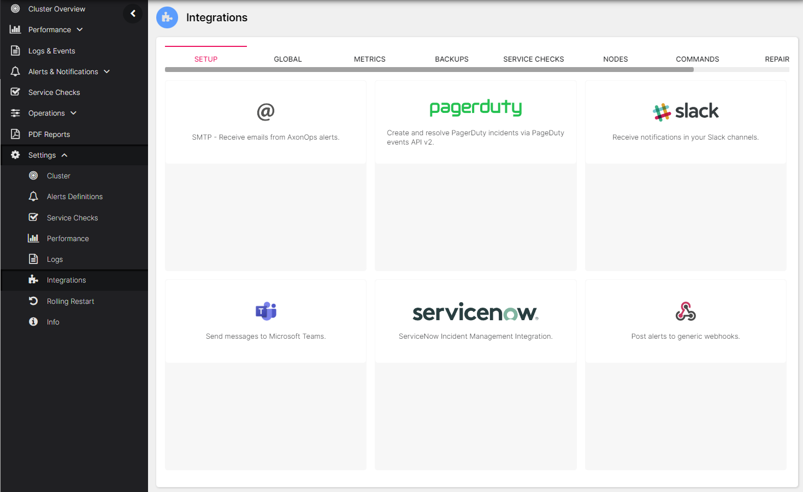

AxonOps provide various integrations for the notifications.

The functionality is accessible via ***Settings > Integrations***

The current integrations are:

* [SMTP / Email](email-integration.md)
* [Pagerduty](pagerduy-integration.md)
* [Slack](slack-integration.md)
* [Microsoft Teams](microsoft-teams-integration.md)
* [ServiceNow](servicenow-integration.md)
* OpsGenie
* Generic webhooks
* [Log file](log-file-integration.md) (configurable through `axon-server.yml`)

!!! infomy

## Incident Management Integration

AxonOps is designed as a monitoring and alerting system that:

* Detects issues
* Triggers alerts
* Sends recovery events when conditions return to normal

However, AxonOps is not intended to replace dedicated incident management platforms like PagerDuty or OpsGenie.

Incident management platforms provide capabilities such as:

* Converting alerts into incidents with defined workflows
* Escalation policies when initial responders don't acknowledge
* Repeat notifications until someone takes action
* Acknowledgment to pause notifications while investigating
* Auto-resolution when recovery events arrive

### Reducing Alert Fatigue

One of the most valuable features of incident management platforms is alert grouping. When a systemic issue affects your Cassandra or Kafka cluster, it often triggers alerts from multiple nodes simultaneously. Without grouping, an on-call engineer might receive dozens of notifications for what is essentially a single incident.

Alert grouping consolidates related alerts into a single incident, providing clarity on the nature of the outage while dramatically reducing notification noise.

For more information on configuring alert grouping and incident rules, see:

* [OpsGenie: Automatically Create an Incident via Incident Rules](https://support.atlassian.com/opsgenie/docs/automatically-create-an-incident-via-incident-rules/) - Configure rules to automatically create incidents from matching alerts, with built-in deduplication
* [PagerDuty: Content-Based Alert Grouping](https://support.pagerduty.com/main/docs/content-based-alert-grouping) - Group alerts based on matching field values like source, component, or severity
* [PagerDuty: Time-Based Alert Grouping](https://support.pagerduty.com/main/docs/time-based-alert-grouping) - Group all alerts on a service within a specified time window

##  Routing
AxonOps provide a rich routing mechanism for the notifications.

The current routing options are:

* Global - this will route all the notifications
* Metrics - notifications about the alerts on metrics
* Backups - notifications about the backups / restore
* Service Checks - notifications about the service checks / health checks
* Nodes - notifications raised from the nodes
* Commands - notifications from generic tasks
* Repairs - notifications from Cassandra repairs
* Rolling Restart - notification from the rolling restart feature

Each severity (`info, warning, error`) can be routed independently 

   

## Errors per routing mechanism and severity levels

### Backup

| **Source** | **Severity**   | **Description**                                                          |
| :--------- | :------------- | :----------------------------------------------------------------------- |
| Backup     | Critical	      | Any error that is returned from the 3rd party remote location providers. |
| Backup     | Warning	      | Clear local snapshots timed out                                          |
| Backup     | Warning	      | Unable to find local snapshot                                            |
| Backup     | Warning	      | Local backup process erros                                               |
| Backup     | Warning	      | Clear remote snapshot timed out                                          |
| Backup     | Warning	      | Remote backup process errors                                             |
| Backup     | Warning	      | Unable to find remote snapshot                                           |
| Backup     | Warning	      | Clear remote snapshot timed out                                          |
| Backup     | Warning	      | Backup not triggered (Backups paused)                                    |
| Backup     | Warning	      | Failed to create backup                                                  |
| Backup     | Warning	      | Failed to create remote config for backups                               |
| Backup     | Warning	      | Create cassandra snapshot failed                                         |
| Backup     | Warning	      | Snapshot request timed out                                               |
| Backup     | Warning	      | Cassandra node is inactive                                               |
| Backup     | Info	          | Local backup created successfully                                        |
| Backup     | Info	          | Backup deleted succesfully                                               |

### Repair

| **Source** | **Severity**   | **Description**                                                          |
| :--------- | :------------- | :----------------------------------------------------------------------- |
| Repair     | Critical	      | Update repairs error, can be casued by tables being created or removed while a repair is running  |
| Repair     | Critical	      | Any error that is generated by Cassandra for a repair processes                                   |
| Repair     | Critical	      | Repair job is over 60% complete and the estimated time to completion is after gc_grace deadline   |
| Repair     | Warning	      | Repair job is over 40% complete and the estimated time to completion is after gc_grace deadline   |
| Repair     | Warning	      | Repair segment failed                                                                             |
| Repair     | Warning	      | Repair segment timed out                                                                          |
| Repair     | Warning	      | Cassandra repair error after n-amount of retries                                                  |
| Repair     | Warning	      | Repair unit errors                                                                                |
| Repair     | Warning	      | Repair errors for nonexistent correlation ID                                                      |
| Repair     | Warning	      | Repair request timed out after n-amount of attempts to connect to host                            |

