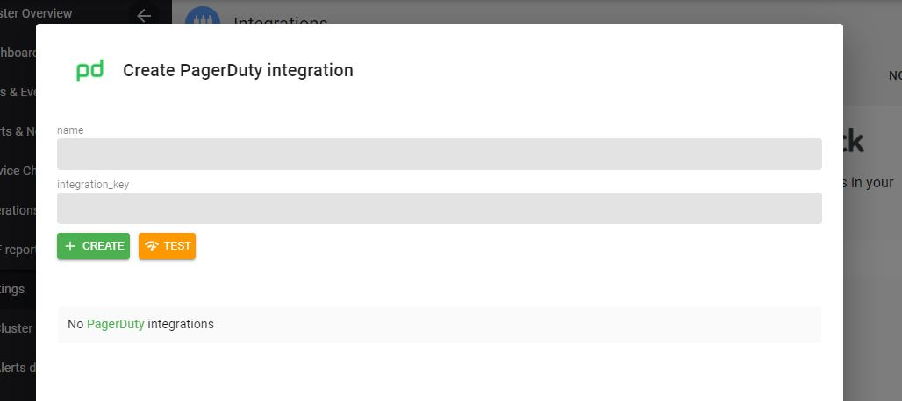

# Set up PagerDuty Integration

### Create PagerDuty Routing Key

Using these [steps](https://support.pagerduty.com/docs/services-and-integrations){target="_blank"}, note the PagerDuty `routing key`.

### Insert PagerDuty Routing Key

On the AxonOps application menu, select `Settings -> Integrations`.

Click the `PagerDuty` area.

Add the PagerDuty `routing key` from the previous step into the `integration_key` field.

