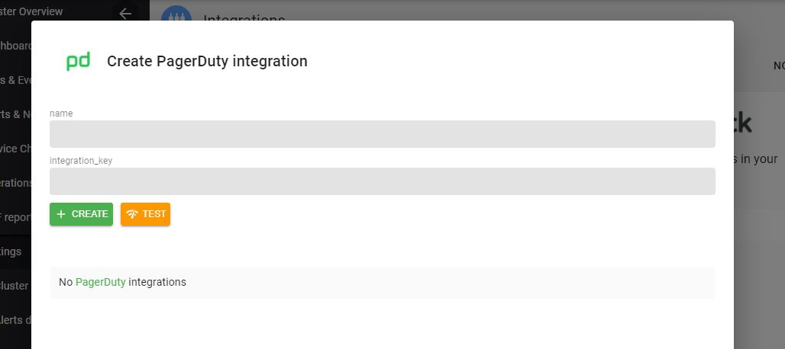

# Setup Pagerduty Integration

###  Create Pagerduty Routing Key

Using these [steps](https://support.pagerduty.com/docs/services-and-integrations){target="_blank"}, note the pagerduty `routing key`.

### Insert Pagerduty Routing Key

On the Axonops application menu, select `Settings -> Integrations` .

`Click` on the `Pagerduty` area.

!!! infomy 

    
    
 Add the Pagerduty `routing key` from the previous step into the `integration_key` field.

