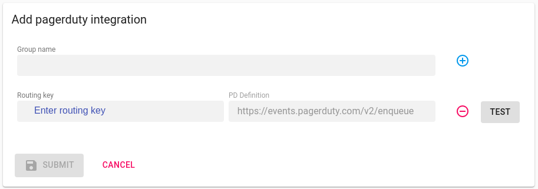
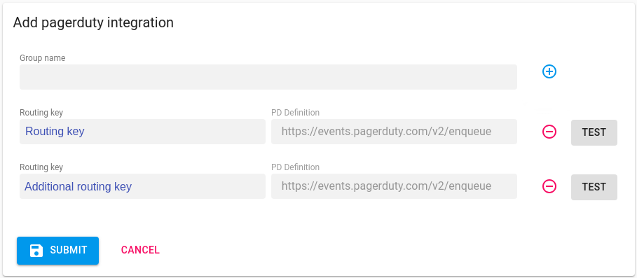
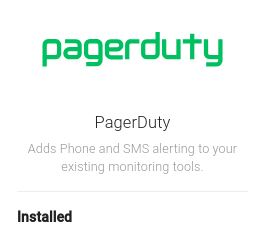
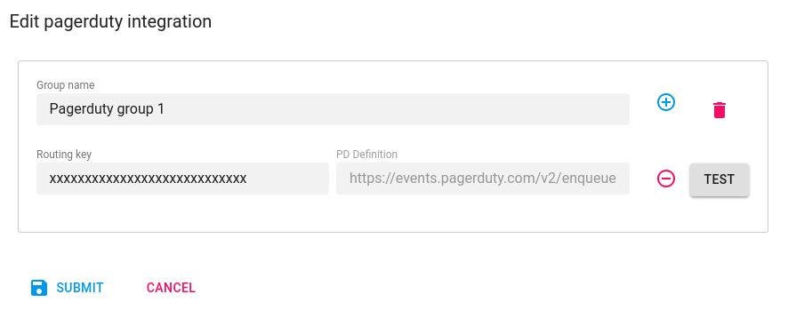

# Setup Pagerduty

<ol>
<li>
    

        <h5> Create pagerduty routing key.</h5>
        
 Using these <a href="https://support.pagerduty.com/docs/services-and-integrations" target="_blank">steps.</a> Please note down the pagerduty <strong>routing key</strong>

    

</li>
<li>

    

        <h5> Insert pagerduty routing key.</h5>
        
On the Axonops application menu, select  <code>Alert & Notifications -> Integration </code>.

        
On the <code>Setup</code>  menu, move the cusror over the pagerduty icon and <code>click</code> on the <code>Add</code> symbol

        

    

</li>
<li> 

    

        <h5> Complete the fields in the pop-up form</h5>
        
 Enter routing key from <code> <a href="#step1">step 1</a>.</code> and <code>click</code> 

        

        
To add additional <code>routing keys</code> click on , enter the additional routing key and <code>click</code>  

        

        
To remove any  <code>routing key</code> click on

        
 Click  and close the pop-up form, should now read <code>Installed</code>. 

        
        
 

        
To Edit any  <code>routing key</code> click on

        

        
and press  to remove specific <code>routing key</code> or  to remove  <code>group of keys</code> and click  

    

</li>
</ul>