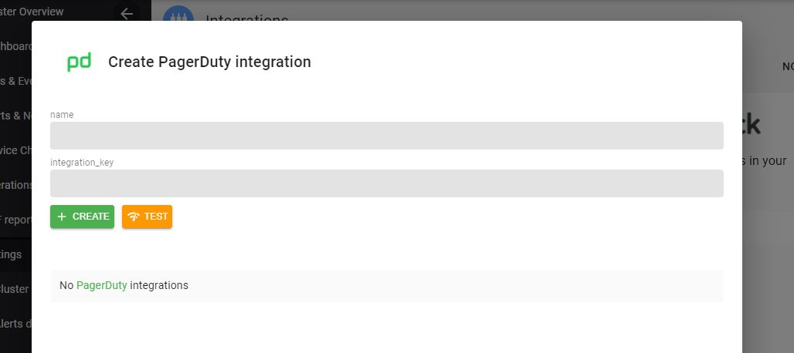

# Setup Pagerduty

###  Create Pagerduty Routing Key

Using these [steps][1]. Please note down the pagerduty ***routing key***

[1]: https://support.pagerduty.com/docs/services-and-integrations

### Insert Pagerduty Routing Key

On the Axonops application menu, select `Settings -> Integrations` .

`Click` on the `Pagerduty` area.

!!! infomy 

    
    

 

