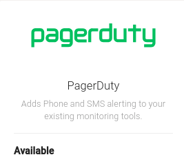

# Setup Pagerduty

<ol>
<li>
    

        <h5> Create pagerduty routing key.</h5>
        
 Using these <a href="https://support.pagerduty.com/docs/services-and-integrations" target="_blank">steps.</a> Please note down the pagerduty <strong>routing key</strong>

    

</li>
<li>

    

        <h5> Insert pagerduty routing key.</h5>
        
On the Axonops application menu, select  <code>Alert & Notifications -> Integration </code>.

        
On the <code>Setup</code>  menu, move the cusror over the pagerduty icon and <code>click</code> on the <code>Add</code> symbol

        

    

</li>
<li> 

    

        <h5> Complete the fields in the pop-up form</h5>
        <ul>
       <li> 
 Enter routing key from <code> <a href="#step1">step 1</a>.</code> and <code>click</code> 
</li>
       

       <li>
To add additional <code>routing keys</code> click on , enter the additional routing key and <code>click</code>  
</li>
       

       <li>
To remove any  <code>routing key</code> click on
</li>

       <li>
 Click  and close the pop-up form, should now read <code>Installed</code>. 
</li>
        
       
 

       <li>
To Edit any  <code>routing key</code> click on
</li>
       

       <li>
and press  to remove specific <code>routing key</code> or  to remove  <code>group of keys</code> and click  
</li>
       <li>
To Remove pagerduty <code>groups</code>  move the cusror over the pagerduty icon <code>click</code> on the <code>Delete</code> symbol and <code>Confirm</code>
</li>
       

    </ul>

    

</li>
</ul>