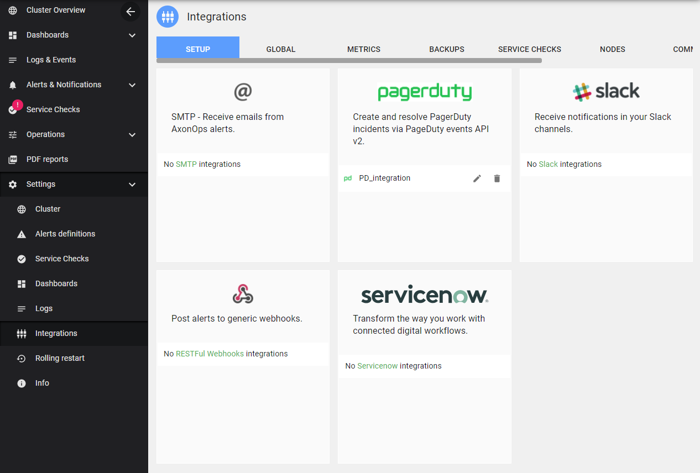
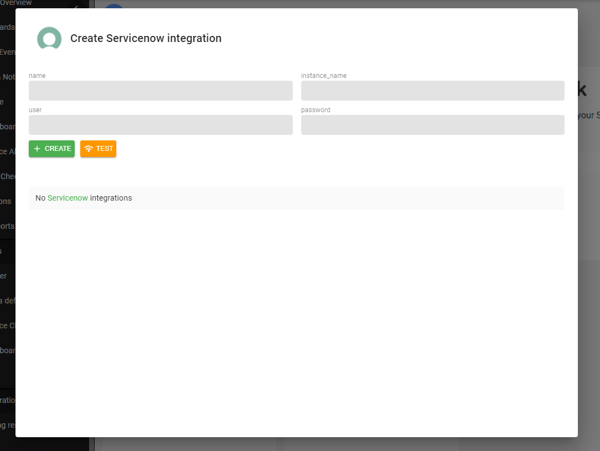
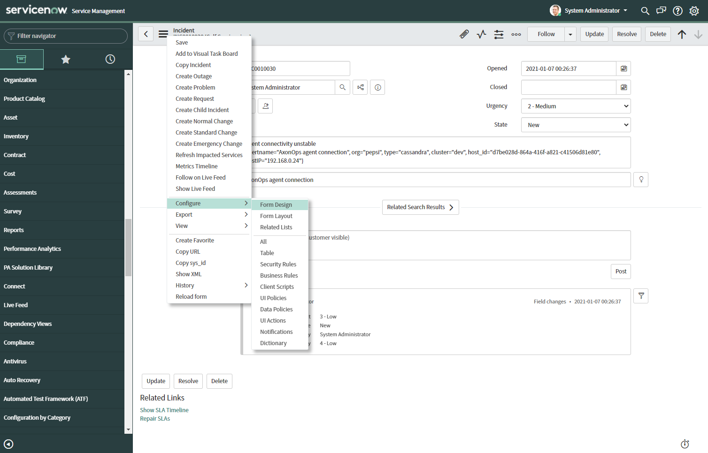

Navigate to  ***Settings > Integrations*** and click on ***ServiceNow***

Once you have gathered your **instance name**, **username** and **password** from ServiceNow, you can validate the form:

> If you want to see the detailed description of a notification, you'll need to add the `description` field from ServiceNow incidents templates. 

