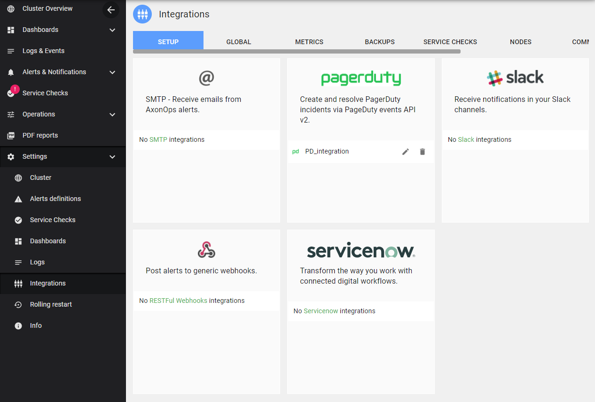
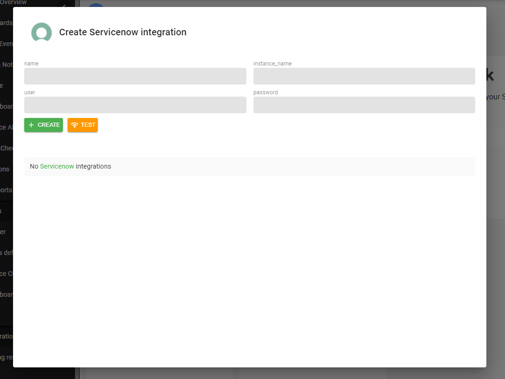
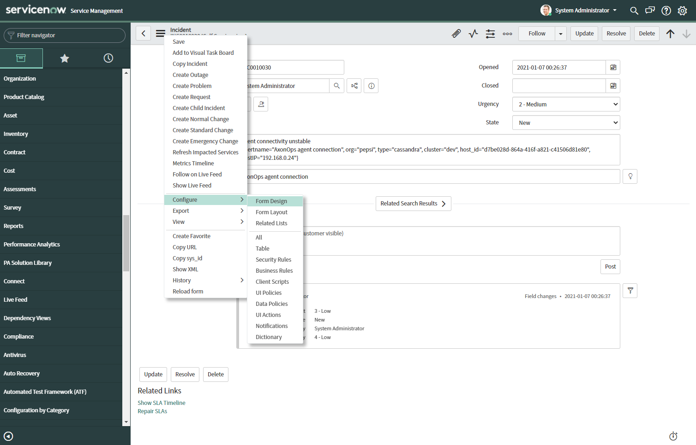
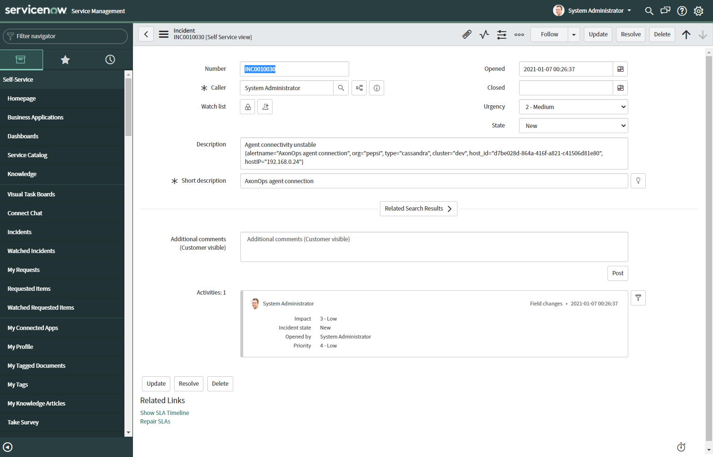

# Setup ServiceNow Integration

## Login to ServiceNow

Navigate to  `Settings -> Integrations` and click on `ServiceNow`.

Gather the `instance name`, `username`, and `password` from ServiceNow to fill out the form:

## Update ServiceNow Incident Template

If you want to see the detailed description of a notification, you'll need to add the `description` field into the ServiceNow incidents templates.

