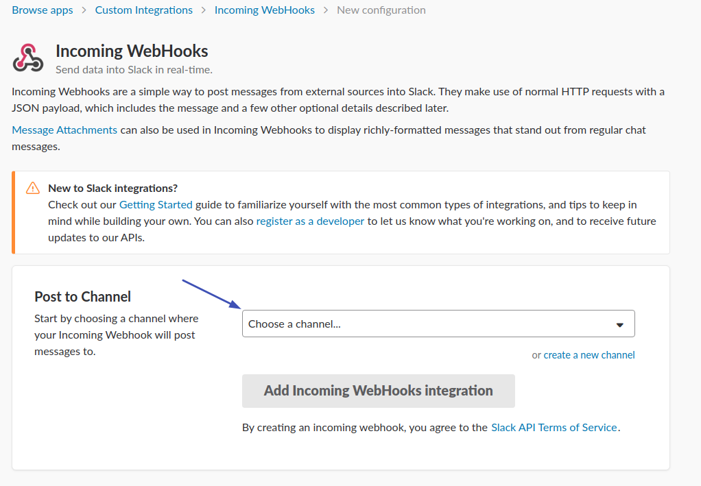
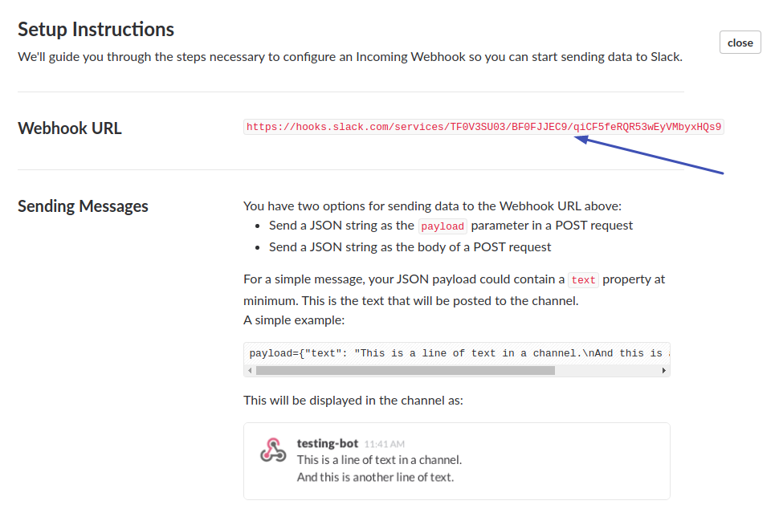
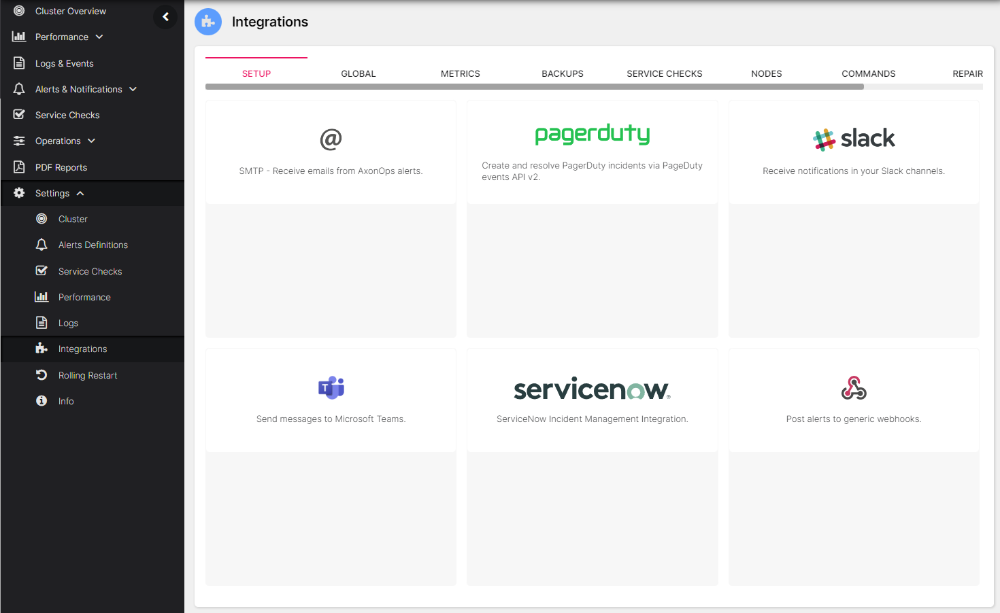
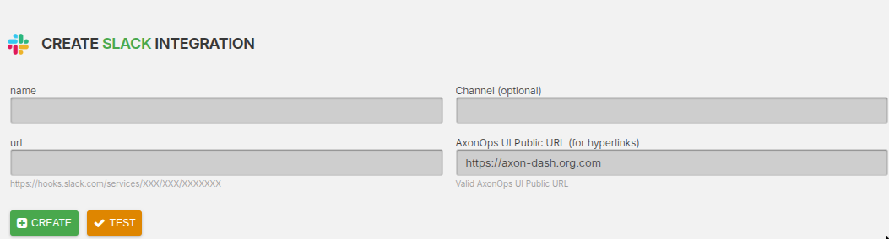

# Setup Slack Integration

###  Create Slack Incoming Webhooks

Add the [Incoming WebHooks](https://slack.com/marketplace/A0F7XDUAZ-incoming-webhooks){target="_blank"} app to Slack.

> Note: Ensure you're on the correct Slack Workspace by using the Workspace indicator on the top left.

In the `Post to Channel` Box, select an option from the `Choose a channel...` dropdown menu.

Click `Add Incoming WebHooks Integration`.

!!! infomy 

    

Copy and make a note of the `WebHook URL` that appears in the `Setup Instructions`.

!!! infomy 

    

### Creating the Slack integration on axon-server

On the Axonops application menu, select `Settings -> Integrations` .

Click on the `Slack` area.

!!! infomy 

    

[1]: #create-slack-incoming-webhooks

Add the `Webhook URL` from the previous step into the `url` field.

Optionally, set the `Channel` field to send alerts to a channel other than the default channel
that was defined when the WebHooks Integration was added to the Slack Workspace.

!!! infomy 

    

