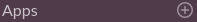
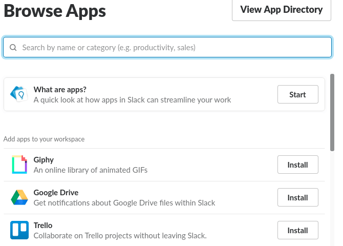
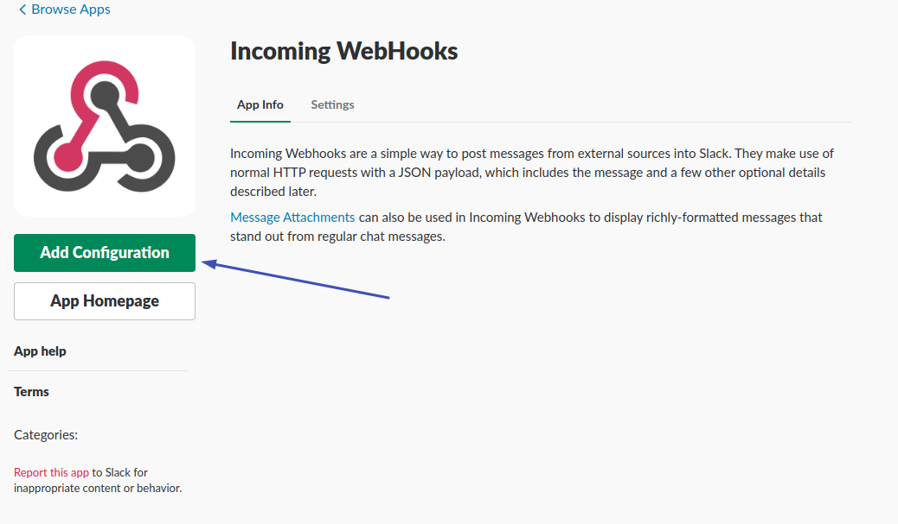
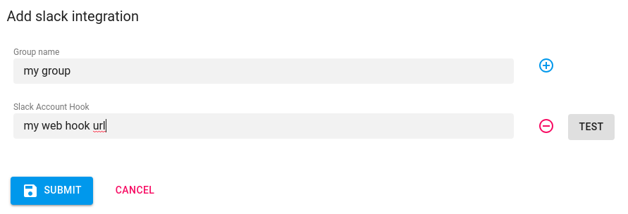
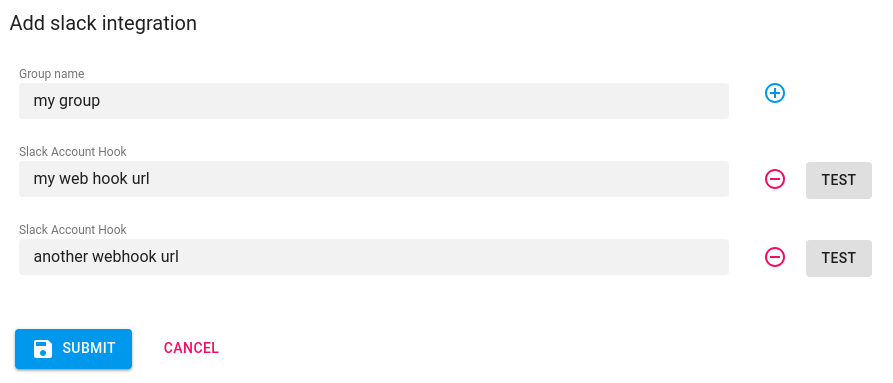
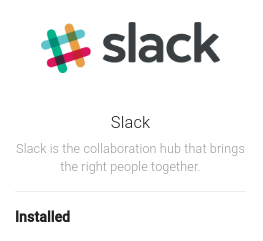
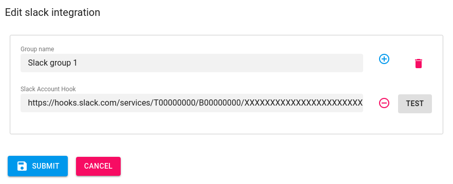
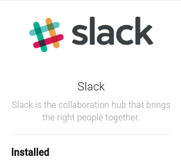

# Setup Slack

<ol>
    <li>
        

            <h5> Create Slack incoming WebHooks.</h5>
            <ul>
                <li>Go to Slack <code>Application</code></li>
                <li>On the side menu click  </li>
                <li>In search box type <code>Incoming Webhooks</code></li>
                <li>From the App directory click <code>Install</code> on <code>Incoming WebHooks App.</code></li>
                

                    

                

                <li><code>Click</code> Add Configuration </li>
                

                    

                

                <li>In <code>Post to Channel</code> Box select an option from the<code>choose a channel</code> dropdown
                    menu .</li>
                <li><code>Click</code> <code>Add Incoming WebHooks Integration</code></li>
                

                    

                

                <li id="step1"><code>Copy</code> and make a note of the <code>WebHook URL</code> that appears in the
                    <code>Setup Instructions</code>.</li>
                

                    

                

            </ul>
        

    </li>

    <li>

        

            <h5> Insert Slack WebHook URL.</h5>
            
On the Axonops application menu, select <code>Alert & Notifications -> Integration </code>.

            
On the <code>Setup</code> menu, move the cursor over the slack icon and <code>click</code> on the
                <code>Add</code> symbol
            

            

                

            

        

    </li>
    <li>

        

            <h5> Complete the fields in the pop-up form</h5>
            <ul>
                <li>
                    
 Enter <code>Group name</code> &amp; <code>WebHook URL</code> from <code> <a href="#step1">step 1</a>.</code>
                        and <code>click</code> 

                </li>
                

                    

                

                <li>
                    
To add additional <code>WebHook URLs</code> click on , enter the additional WebHook URL and <code>click</code>  

                </li>
                

                    

                

                <li>
                    
To remove any <code>WebHook URL</code> click on
                    

                </li>

                <li>
                    
 Click 
                        and close the pop-up form, on the Integrtions Menu the Slack Icon should now read <code>Installed</code>.
                        </lip>
                </li>
                

                    

                    

                

                <li>
                    
To Edit any <code>WebHook URL</code> click on
                    

                </li>
                

                    

                

                <li>
                    
and press  to remove specific
                        <code>WebHook URL</code> or  to
                        remove <code>group of keys</code> and click 
                    

                </li>
                <li>
                    
To Remove Slack <code>groups</code> move the cusror over the
                        pagerduty icon <code>click</code> on the <code>Delete</code> symbol and <code>Confirm</code>

                </li>
                

                    

                

            </ul>

        

    </li>
    </ul>