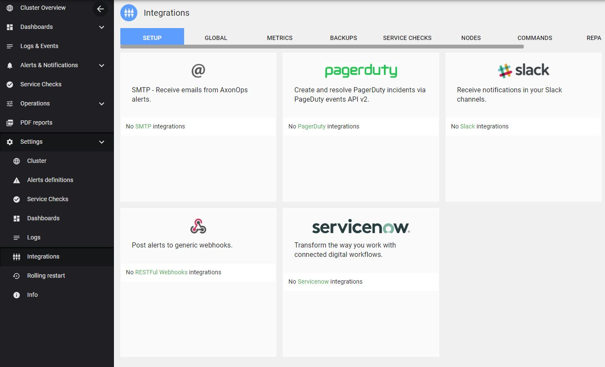

# Setup Slack

###  Create Slack Incoming Webhooks

* Go to Slack `Application`
* On the side menu click  
* In search box type `Incoming Webhook`s
* From the App directory click `Install` on `Incoming WebHooks App`.

!!! infomy 

    

* `Click` Add Configuration

!!! infomy 

    

* In `Post to Channel` Box select an option from the `choose a channel` dropdown menu .

* `Click` `Add Incoming WebHooks Integration`

!!! infomy 

    

* `Copy` and make a note of the `WebHook URL` that appears in the `Setup Instructions`.

!!! infomy 

    

### Creating the Slack integration on axon-server

On the Axonops application menu, select `Settings -> Integrations` .

`Click` on the `Slack` area.

!!! infomy 

    

[1]: #create-slack-incoming-webhooks

!!! infomy 

    

