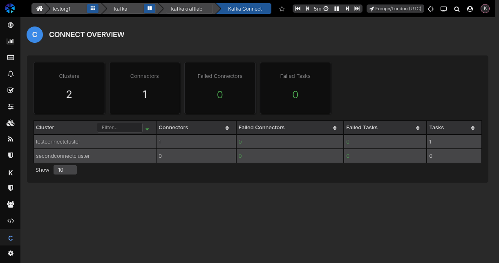
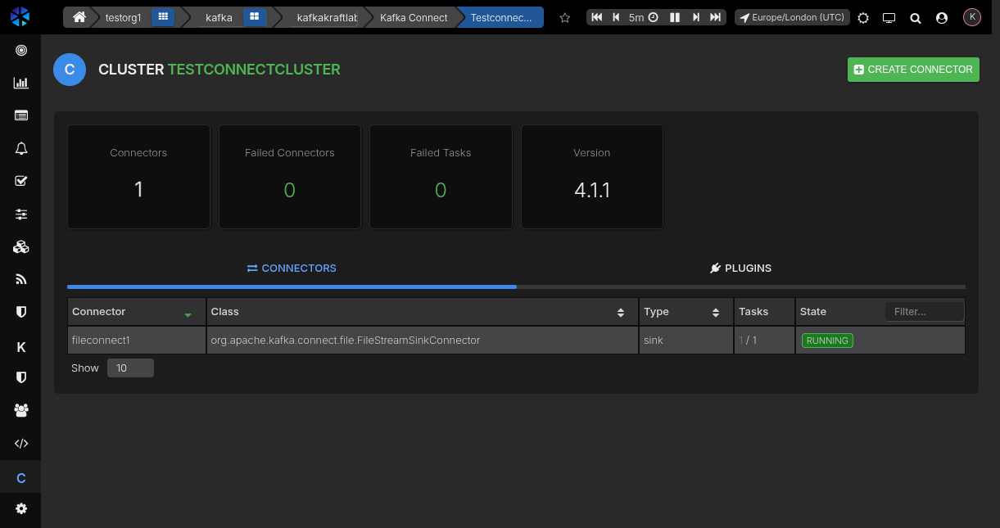
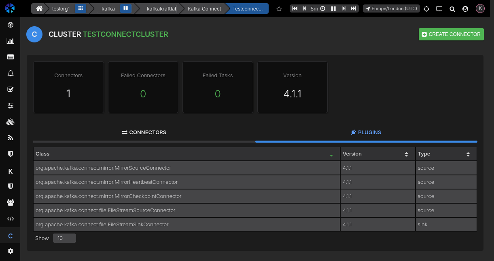
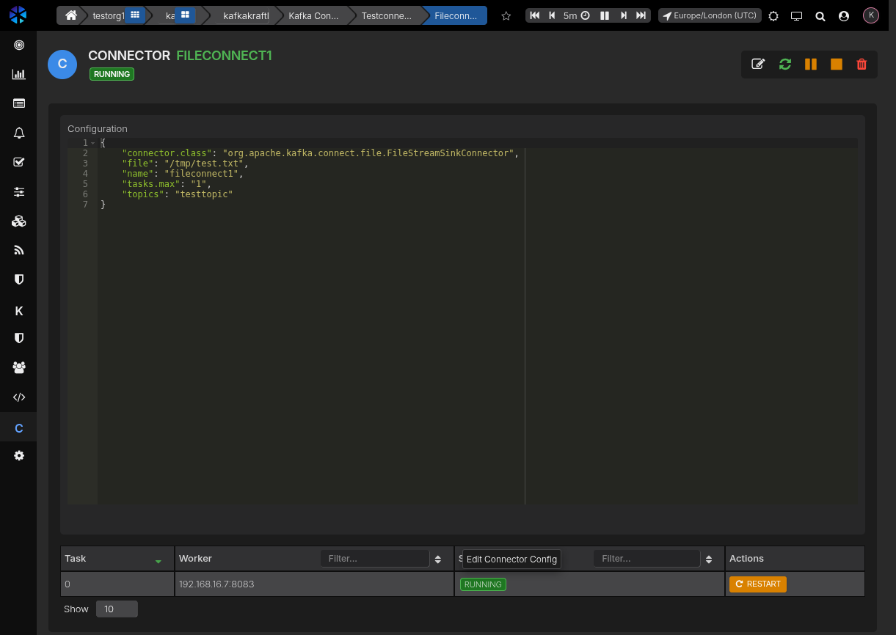
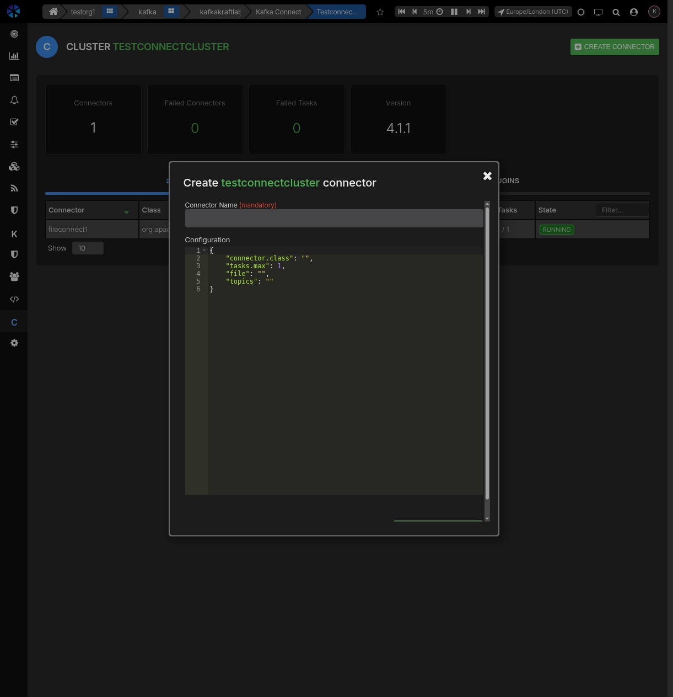

# Kafka Connect

## What is Kafka Connect

Kafka Connect is a framework for moving data between Kafka and external systems using connectors. 
It standardizes ingestion (source connectors) and export (sink connectors) so you can build pipelines without writing custom consumers or producers.

Common uses:
- Load data from databases or SaaS apps into Kafka.
- Stream Kafka topics to data warehouses, object storage, or search systems.
- Keep external systems in sync with Kafka topics.

## Kafka Connect in AxonOps

AxonOps integrates with your Kafka Connect REST endpoints through the agent.
Once configured, you can manage your entire Connect deployment from the AxonOps UI.

### Connect overview

The Connect overview page provides a summary of all your Connect clusters at a glance. Summary cards show the total number of **Clusters**, **Connectors**, **Failed Connectors**, and **Failed Tasks** across your deployment.

Below the summary cards, a table lists each Connect cluster with its connector and task counts. You can filter clusters by name and sort by any column. Click on a cluster row to drill into its details.



### Cluster detail

Clicking a cluster opens the cluster detail view. Summary cards show the cluster-level **Connectors** count, **Failed Connectors**, **Failed Tasks**, and the Connect **Version**.

The view has two tabs:

**Connectors** — Lists all connectors deployed to the cluster. Each row shows the connector name, class, type (source or sink), running tasks ratio and current state. You can filter by state and sort by any column. Click a connector row to view its full details.



**Plugins** — Lists all connector plugins available on the cluster, showing the fully-qualified class name, version, and type (source or sink).



### Connector detail

Selecting a connector opens the connector detail view. The header displays the connector name and its current state (e.g. **RUNNING**).



The page is divided into three sections:

**Configuration** — A JSON editor showing the connector's current configuration. Click the **Edit** icon in the toolbar to modify and save changes.

**Tasks** — A table listing each task with its ID, assigned worker address, current status, and a **Restart** button to restart individual tasks.

### Connector lifecycle actions

The connector toolbar provides the following actions:

| Icon | Action | Description |
|------|--------|-------------|
| :material-pencil: | **Edit** | Open the configuration editor to update the connector |
| :material-refresh: | **Restart** | Restart the connector and all its tasks |
| :material-pause: | **Pause** | Pause the connector — tasks stop processing but are not removed |
| :material-stop: | **Stop** | Stop the connector — tasks are shut down |
| :material-delete: | **Delete** | Permanently remove the connector from the cluster |

Individual tasks can be restarted from the **Tasks** table using the per-task **Restart** button.

### Creating a connector

Click the **Create Connector** button on the cluster detail page to open the creation dialog.



Provide:

1. **Connector Name** (mandatory) — A unique name for the connector.
2. **Configuration** — A JSON payload specifying the connector class and its settings. The editor is pre-populated with a template.

Click **Create Connector** to deploy it to the cluster.

## Configure Kafka Connect access

Enable the Connect client in the agent configuration and define one or more clusters.

### YAML configuration

```yaml
kafka:
  connect_client:
    enabled: true
    connectTimeout: 5s
    readTimeout: 5s
    requestTimeout: 5s
    clusters:
      - name: "connect-prod"
        url: "https://connect.example.com:8083"
        username: "connect_user"
        password: "connect_password"
        tls:
          enabled: true
          caFilepath: "/etc/ssl/certs/ca.pem"
          certFilepath: "/etc/ssl/certs/client.pem"
          keyFilepath: "/etc/ssl/private/client.key"
          insecureSkipTlsVerify: false
```

Notes:

- `clusters` is a list; `name` is used to target a specific Connect cluster.
- `username` and `password` enable HTTP basic auth.
- `token` is supported in config files if your Connect endpoint uses token auth.
- TLS settings are optional; if disabled, TLS 1.2+ is still enforced by the client.

### Environment variables

You can configure a single cluster via environment variables:

```bash
CONNECT_CLIENT_ENABLED=true
CONNECT_CLIENT_CONNECT_TIMEOUT=5s
CONNECT_CLIENT_READ_TIMEOUT=5s
CONNECT_CLIENT_REQUEST_TIMEOUT=5s

CONNECT_CLIENT_CLUSTER_NAME=connect-prod
CONNECT_CLIENT_CLUSTER_URL=https://connect.example.com:8083
CONNECT_CLIENT_CLUSTER_USERNAME=connect_user
CONNECT_CLIENT_CLUSTER_PASSWORD=connect_password

CONNECT_CLIENT_CLUSTER_TLS_ENABLED=true
CONNECT_CLIENT_CLUSTER_TLS_CAFILEPATH=/etc/ssl/certs/ca.pem
CONNECT_CLIENT_CLUSTER_TLS_CERTFILEPATH=/etc/ssl/certs/client.pem
CONNECT_CLIENT_CLUSTER_TLS_KEYFILEPATH=/etc/ssl/private/client.key
CONNECT_CLIENT_CLUSTER_TLS_VERIFY_ENABLED=false
```

Note on TLS verification: `CONNECT_CLIENT_CLUSTER_TLS_VERIFY_ENABLED` maps to the `insecureSkipTlsVerify` field.
When set to `true`, certificate verification is skipped.

## Troubleshooting

If you see no clusters or connectors:
- Confirm `CONNECT_CLIENT_ENABLED=true` (or `connect_client.enabled: true`).
- Verify the `url` is reachable from the agent host.
- Confirm TLS certificates and paths are valid.
- Check credentials if basic auth is required.