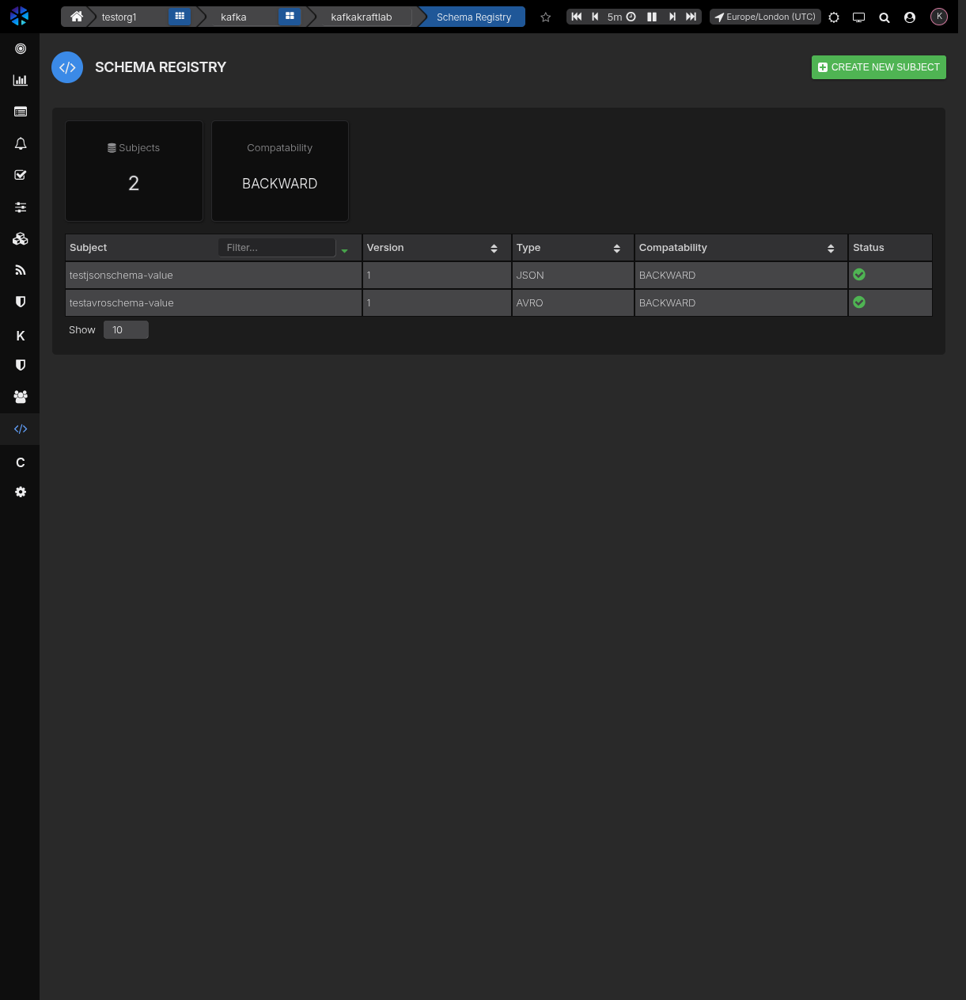
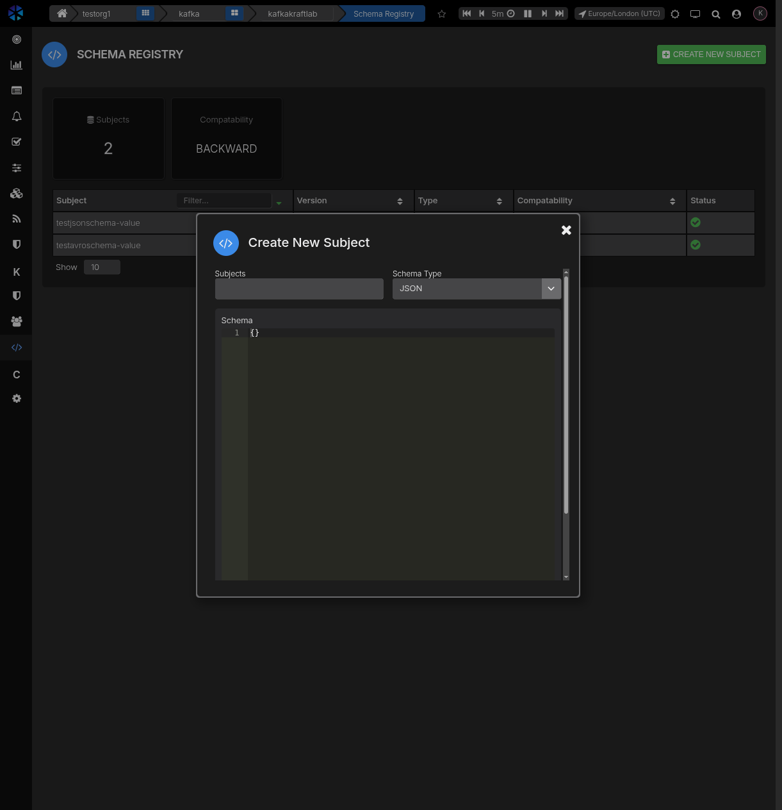
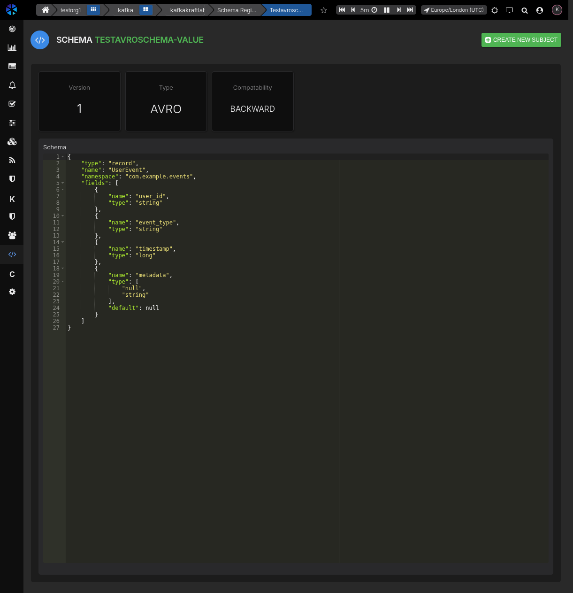

# Schema Registry (AxonOps)

## What is Schema Registry

Schema Registry provides a centralized repository for managing and validating schemas used by Kafka producers and consumers. It ensures data compatibility and enables schema evolution across your streaming applications.

Common uses:

- Store and version Avro, Protobuf, and JSON schemas.
- Enforce compatibility rules when schemas evolve.
- Provide schema validation for producers and consumers.
- Enable schema discovery across teams and applications.

## Schema Registry in AxonOps

AxonOps connects to your existing Kafka Schema Registry so you can browse schemas, versions, and compatibility from the AxonOps UI. Additionally, AxonOps provides monitoring capabilities through Prometheus metrics scraping. Once configured, you can:

- Browse subjects and view schema versions and details.
- Register new schema versions.
- View Schema Registry metrics on dedicated dashboards.
- Monitor schema counts (registered, deleted).
- Track request rates and latencies.
- Monitor schema types (Avro, JSON, Protobuf).
- View Kafka store operations (consumer lag, flush times).
- Collect Schema Registry logs.

### Subjects overview

The Schema Registry page shows summary cards for the total number of **Subjects** and the global **Compatibility** level. Below the summary, a table lists all registered subjects with their latest version number, schema type (AVRO, JSON, or PROTOBUF), compatibility setting, and health status.

You can filter subjects by name and sort by any column. Click a subject row to view its schema details.



### Creating a new subject

Click the **Create New Subject** button to open the creation dialog. Provide:

1. **Subject** — The subject name (typically follows the `<topic>-key` or `<topic>-value` convention).
2. **Schema Type** — Select AVRO, JSON, or PROTOBUF from the dropdown.
3. **Schema** — Enter the schema definition in the editor.

Click **Save schema** to register the new subject.



### Subject detail

Selecting a subject opens the detail view. Summary cards show the current **Version**, **Type**, and **Compatibility** level for the subject.

The schema definition is displayed in a syntax-highlighted JSON editor, allowing you to inspect the full structure of the schema including field names, types, and defaults.




## Prerequisites

- A running Kafka Schema Registry service (AxonOps, Confluent, or compatible).
- Network access from axon-agent to the registry endpoint.
- Credentials or tokens if your registry is secured.

## Configure the agent

Enable the schema registry client in axon-agent configuration:

### Environment variables

Configure Schema Registry via environment variables:

```bash
# Schema Registry connection (required for browsing subjects)
SCHEMA_REGISTRY_URL=http://schema-registry:8081

# Schema Registry metrics endpoint (required for monitoring)
SCHEMA_REGISTRY_METRICS_URL=http://schema-registry:8081/metrics

# Optional: Authentication for Schema Registry
SCHEMA_REGISTRY_USERNAME=schema_user
SCHEMA_REGISTRY_PASSWORD=schema_password

# Optional: Authentication for metrics endpoint
SCHEMA_REGISTRY_METRICS_USERNAME=metrics_user
SCHEMA_REGISTRY_METRICS_PASSWORD=metrics_password

# Optional: Scrape timing configuration
SCHEMA_REGISTRY_METRICS_TIMEOUT=30s
SCHEMA_REGISTRY_METRICS_INTERVAL=30s

# Optional: Log file location for log collection
SCHEMA_REGISTRY_LOG_LOCATION=/var/log/kafka/schema-registry.log
```

### YAML configuration

You can also configure Schema Registry in the agent YAML configuration:

```yaml
kafka:
  schema_registry_client:
    enabled: true
    url: "https://schema-registry.example.com"
    # Use one of the authentication methods below:
    # username: "registry_user"
    # password: "registry_password"
    # bearerToken: "registry_bearer_token"
    # Optional TLS settings
    # tls:
    #   enabled: true
    #   caFilepath: /path/to/ca.pem
    #   insecureSkipTlsVerify: false
```

After saving the file, restart axon-agent so it can connect.

## Use Schema Registry in AxonOps

1. Open your Kafka cluster in the AxonOps UI.
2. Select **Schema Registry** from the left navigation.
3. Browse the subjects table to find the schema you need.
4. Click a subject to view its schema definition and version history.
5. Use **Create New Subject** to register new schemas.

Depending on your registry implementation and permissions, AxonOps may allow additional actions (such as changing compatibility or deleting versions). If your registry is read-only, AxonOps will still provide visibility into metrics, logs, subjects, and versions.

## Dashboard metrics

The Schema Registry dashboard displays the following metric categories:

### Schema counts

- **Total registered schemas** - Number of schemas currently registered.
- **Deleted schemas count** - Number of schemas that have been deleted.
- **Master vs Slave role** - Shows whether the node is the primary or replica.

### Schema types

- **Avro schemas** - Count of Avro format schemas.
- **JSON schemas** - Count of JSON format schemas.
- **Protobuf schemas** - Count of Protobuf format schemas.

### Request metrics

- **Request rate** - Number of requests per second.
- **Request latency** - 95th percentile request latency in milliseconds.
- **Error codes** - HTTP error response counts by status code.

### Kafka store operations

- **Connection count** - Number of active producer and consumer connections.
- **Store flush time** - Time taken to flush data to the Kafka store.
- **Failed authentication rate** - Rate of authentication failures.
- **Consumer records consumed rate** - Rate of records consumed from Kafka.
- **Consumer fetch latency** - Average latency for consumer fetch operations.
- **Consumer lag** - Lag in consuming records from Kafka.

## Log collection

When `SCHEMA_REGISTRY_LOG_LOCATION` or `log_location` is configured, AxonOps collects Schema Registry logs and makes them available in the logs viewer. This enables:

- Searching and filtering Schema Registry logs.
- Correlating log events with metrics.
- Troubleshooting schema compatibility issues.

## Troubleshooting

If you see no Schema Registry metrics:

- Confirm `SCHEMA_REGISTRY_METRICS_URL` is set and reachable from the agent host.
- Verify the Schema Registry exposes a `/metrics` endpoint (requires JMX exporter or native metrics).
- Check credentials if authentication is required.
- Ensure the agent is running in Kafka mode with `node_type` set appropriately.

If logs are not appearing:

- Verify `SCHEMA_REGISTRY_LOG_LOCATION` points to the correct log file path.
- Ensure the agent has read permissions for the log file.
- Check that the log file exists and is being written to.

If subjects are not appearing:

- Verify the Schema Registry URL is correct and reachable.
- Check authentication credentials (username/password or bearer token).
- Ensure TLS settings match your Schema Registry configuration.

## Related

- [Schema Registry concepts](../../data-platforms/kafka/schema-registry/index.md)
