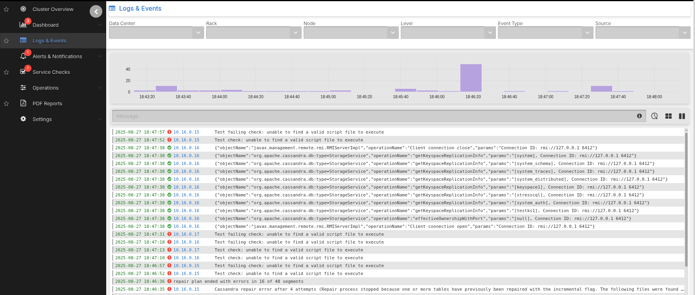
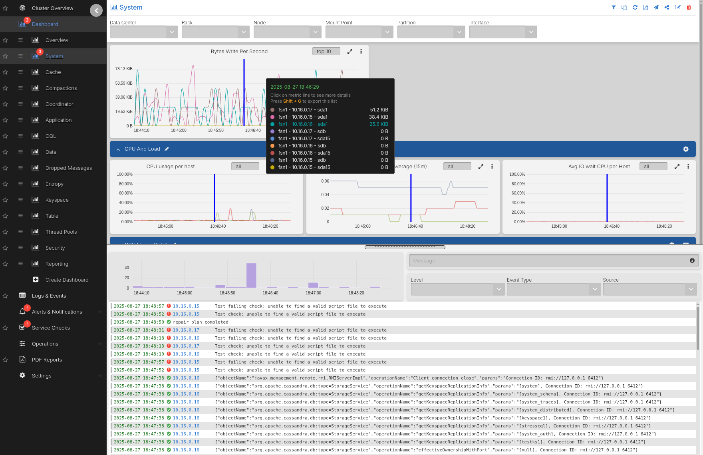
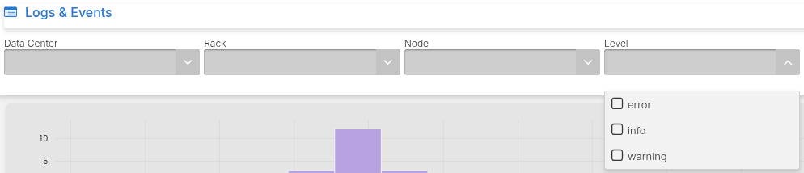

# Logs and Events

AxonOps provides a powerful logging feature that allows you to search and filter logs
based on different parameters such as:

* DC/Rack/Node
* Log Level
* Event Type
* Source
* Log Content

The logs and events are visible in two locations allowing quick access to them without
having to log in to the individual servers:

1. Within the Logs & Events tab:

    

2. Within the AxonOps Dashboard by dragging the bottom handle icon up:

    

## Search by Log Level

Filter logs based on their log levels to focus on specific severity levels. The log level indicates the importance or severity of a message from the most critical (ERROR) to less severe (DEBUG).



### Setting up the Debug Level

To search logs by DEBUG level you have to enable DEBUG logs in Cassandra by editing
the `logback.xml` file:

```xml
<appender name="SYSTEMLOG" class="ch.qos.logback.core.rolling.RollingFileAppender">
    <filter class="ch.qos.logback.classic.filter.ThresholdFilter">
        <level>DEBUG</level>
```

> Note: Enabling DEBUG logs within Cassandra is not advised during normal operations and
should only be activated for short periods of time on select nodes when debugging issues
where INFO logs do not provide enough visibility.
>
> Leaving DEBUG logs on indefinitely can cause immense strain on the Cassandra process
due to its high CPU usage.

## Search by Logs Source and Event Type

You can filter logs based on the log source (`cassandra`, `axon-server`, and `axon-agent` logs) and event type to narrow down search results.


## Search by Content

For free text search, enter a keyword in the Message field or use the `/<expression>/` syntax to search by regex expressions.

### Example Search Terms

Currently the following keyword syntax is supported:

* `hello`
    * matches `hello`
* `hello world`
    * matches `hello` or `world`
* `"hello world"`
    * matches exact `hello world`
* `+-hello`
    * matches excluding `hello`
* `+-"hello world"`
    * matches excluding `hello world`
* `+-hello +-world`
    * matches excluding `hello` or `world`
* `/.*repair.*/`
    * displays logs that contain a specific word or phrase
* `/(Validated|Compacted)/`
    * displays logs that match either what is before or after the `|`, in this case
    `Validated` or `Compacted`
* `/Segment.*deleted/`
    * displays logs that contain both patterns in a line, in this case `Segment` and
    `deleted`
