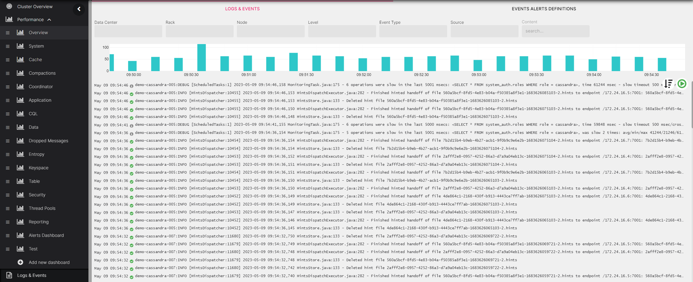
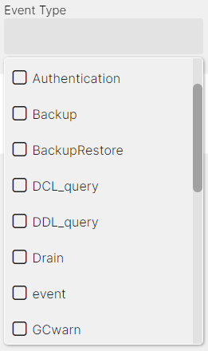
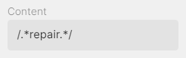
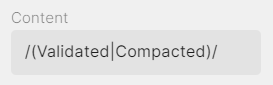
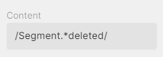

### Logs and Events

AxonOps provides a powerful logging feature that allows you to search and filter logs based on different parameters such as DC/Rack/Node, Log Level, Event Type, Source and Log Content.



The logs and events are visible within AxonOps dashboard and Logs & Events tab allowing quick access to them without having to log in to the individual servers.

#### Logs Source and Event Type

You can filter logs based on the log source (cassandra, axon-server and axon-agent logs) and event type to narrow down search results.



#### Search by Content

For a free text search fulfill the ***content*** input with a keyword or search by regex expression via the `/<expression>/` pattern.

Here are some examples:

* Display logs that contain a specific word or phrase:

 

* Display logs that contain a match either what is before or after the |, in this case "Validated" or "Compacted":



* Display logs that contain both patterns in a line, in this case "Segment" and "deleted:




#### Search by Log Level

To search logs by debug level you have to enable debug mode in cassandra by editing the ***logback.xml*** file:
```
<appender name="SYSTEMLOG" class="ch.qos.logback.core.rolling.RollingFileAppender">
    <filter class="ch.qos.logback.classic.filter.ThresholdFilter">
        <level>DEBUG</level>
```