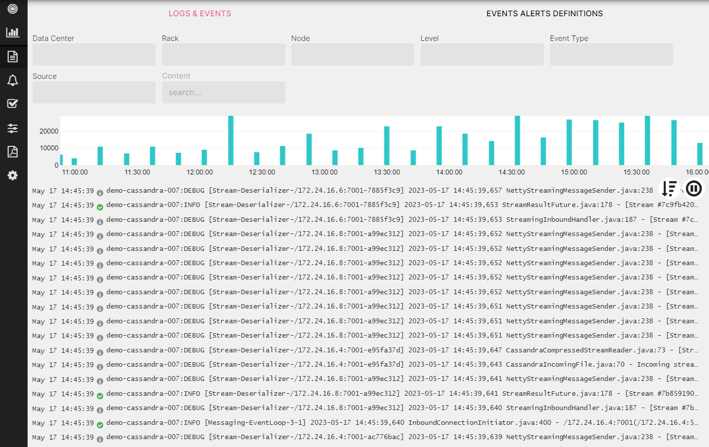
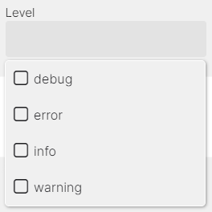
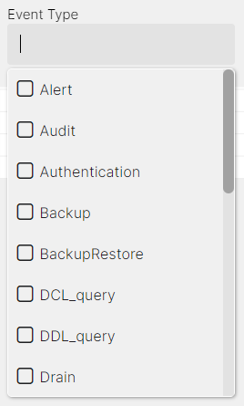
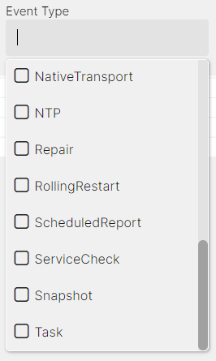

### Logs and Events

AxonOps provides a powerful logging feature that allows you to search and filter logs based on different parameters such as DC/Rack/Node, Log Level, Event Type, Source and Log Content.



The logs and events are visible within AxonOps dashboard and Logs & Events tab allowing quick access to them without having to login to the individual servers.

#### Search by Log Level

Filter logs based on their log levels to focus on specific severity levels. The log level indicates the importance or severity of a message from the most critical (ERROR) to less severe (DEBUG).



##### Setting up the Debug Level

To search logs by debug level you have to enable debug mode in cassandra by editing the ***logback.xml*** file:
```
<appender name="SYSTEMLOG" class="ch.qos.logback.core.rolling.RollingFileAppender">
    <filter class="ch.qos.logback.classic.filter.ThresholdFilter">
        <level>DEBUG</level>
```

#### Search by Logs Source and Event Type

You can filter logs based on the log source (cassandra, axon-server and axon-agent logs) and event type to narrow down search results.




#### Search by Content

For a free text search enter a keyword in the ***content*** input or use the `/<expression>/` syntax to search by regex expression.

Here are some examples:

* Currently the following keyword syntax is supported:

`hello` - matches `hello`

`hello world` - matches `hello` or `world`

`"hello world"` - matches exact `hello world`

`+-hello` - matches excluding `hello`

`+-"hello world"` - matches excluding `hello world`

`+-hello +-world` - matches excluding `hello` or `world`

* Display logs that contain a specific word or phrase:

 

* Display logs that contain a match either what is before or after the |, in this case "Validated" or "Compacted":


* Display logs that contain both patterns in a line, in this case "Segment" and "deleted:


