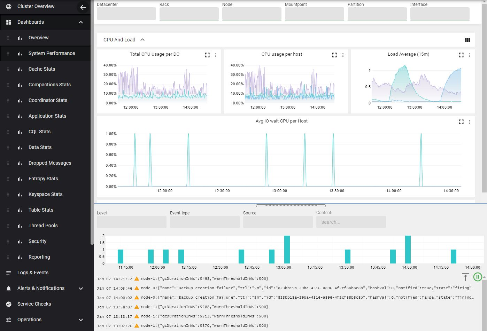
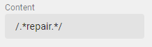

### Logs and Events
The logs and events are visible within AxonOps dashboard allowing quick access to them without having to log in to the individual servers.

For a free text search fulfill the ***content*** input.

You can search by regex expression via the `/<expression>/` pattern.

