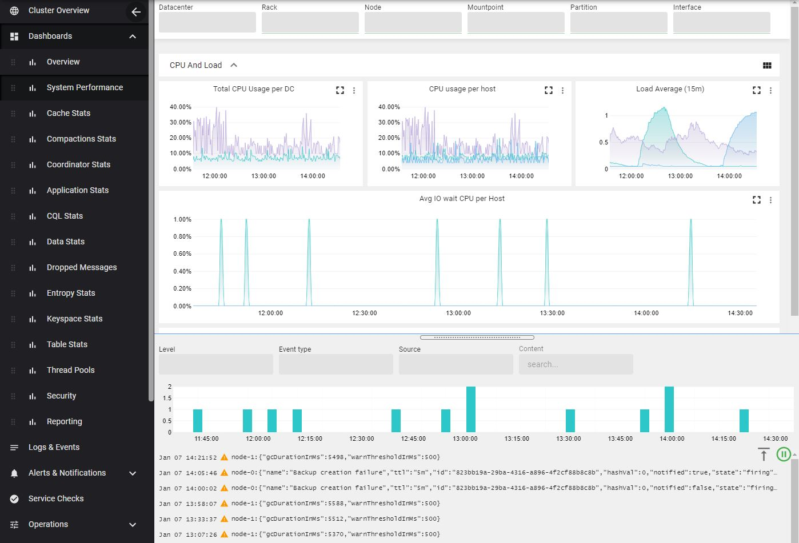

AxonOps dashboards provides a comprehensive set of charts with an embedded view for logs and events. 

You can correlate metrics with logs/events as you can zoom in the logs histogram or metrics charts to drill down both results. 

[Alert rules](../../how-to/setup-alert-rules.md) can be defined graphically in each chart and [Log collection](../../how-to/setup-log-collection.md) is  defined in the bottom part of that page.

!!! infomy 

