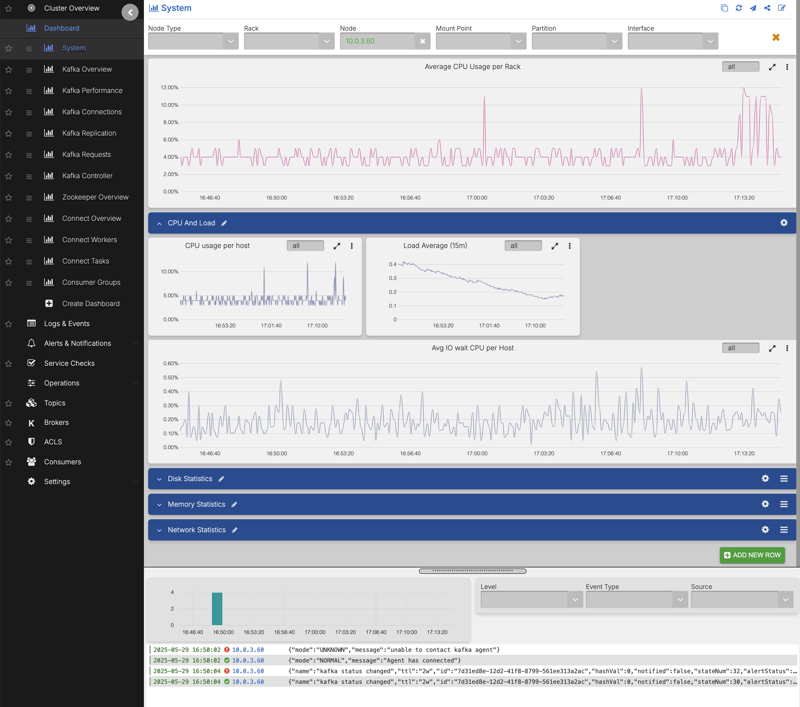

# Kafka

AxonOps dashboards provide a comprehensive set of charts with an embedded view for logs and events.

You can correlate metrics with logs/events by zooming into the logs histogram or metrics charts to drill down on both.

[Alert rules](../../how-to/setup-alert-rules.md) can be defined in each chart. [Log collection](../../how-to/setup-log-collection.md) is defined in the bottom part of the page.

For a detailed list of Kafka metrics and dashboards, see the [Kafka Metrics Reference](../../metrics/kafka/all_kafka_dashboards_metrics_reference.md).

