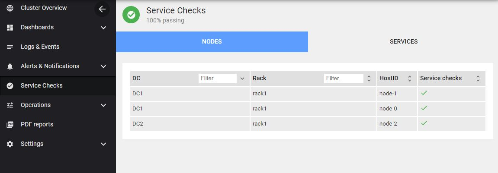
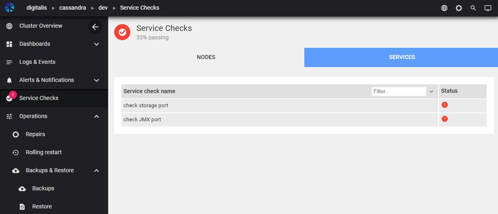
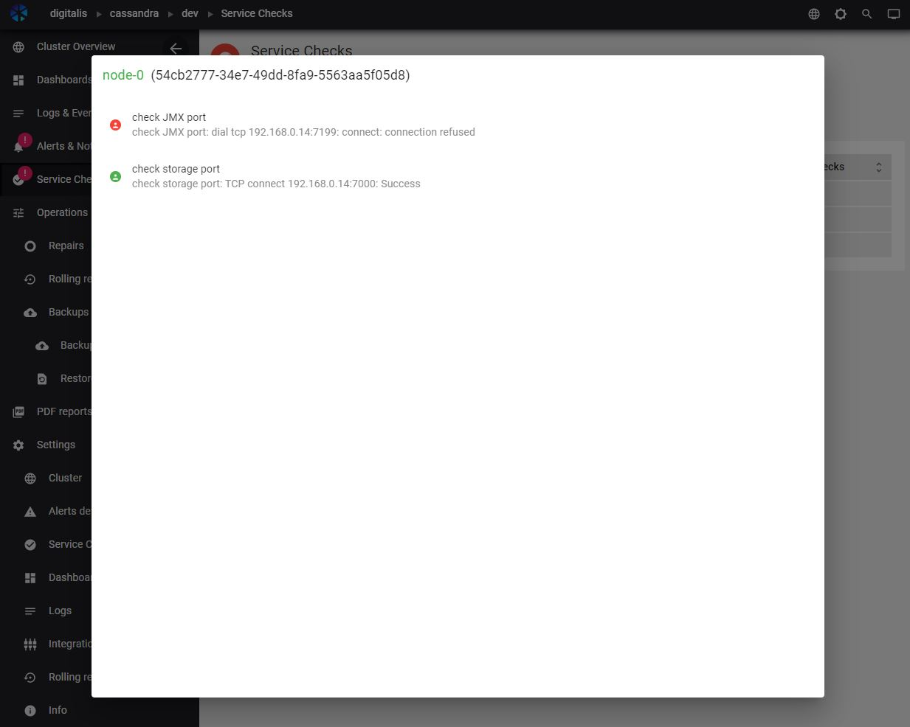
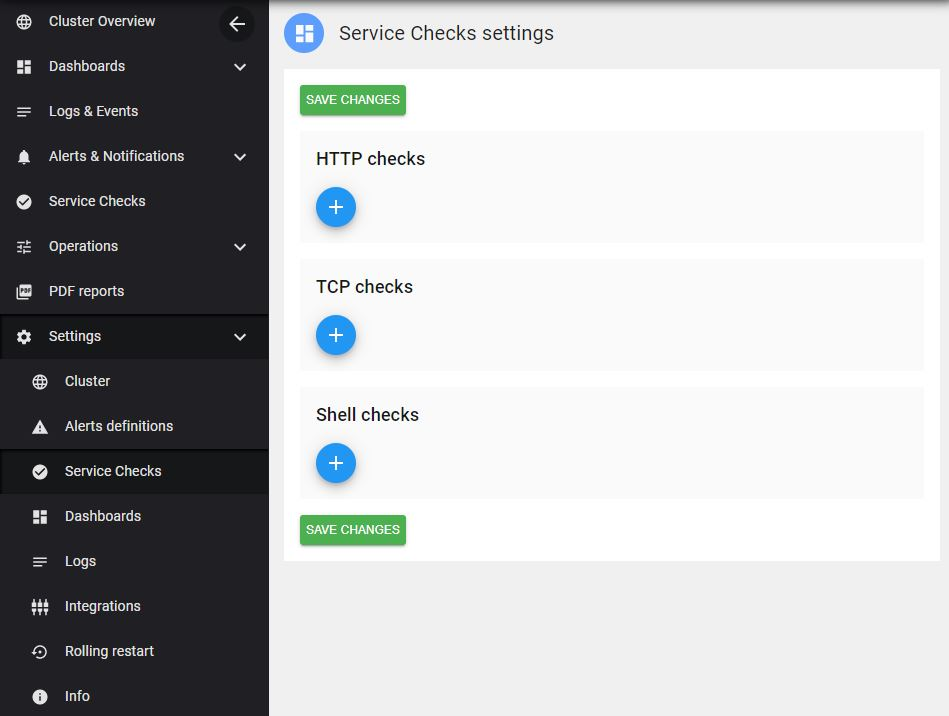
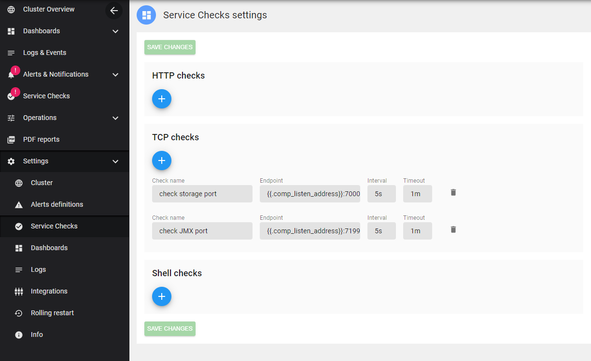

# Overview

Service Checks in AxonOps lets you configure custom checks using three types of checks:

1. Shell Scripts
2. HTTP endpoint checks
3. TCP endpoint checks


The functionality is accessible via the **Service Checks** menu.

You can list the service checks by **node**:


Or by **services**:



You can click on a row within the node view to see all the **services** for that given node.



The following shows a successful check:


And a failing check:


## Configure service checks
To set up checks, go to **Settings > Service Checks** and click one of the **+** buttons.


> Any changes made and saved are automatically pushed down to the agents. There is no need to deploy the check scripts to individual servers like you may do for instance with Nagios. The status will show once the check has been executed on the agent, so it might take some time depending on the interval you have specified within the Service Checks. Although the first execution of the checks will be spread across 30 seconds to prevent running all the checks at the same time.

## Service checks templating
You can provide templated checks with the following pattern: `{{.variable_name}}`



>`{{.comp_listen_address}}` will be replaced with the **Cassandra listen address**.

For instance, port `7000` in the previous example for ***check storage port*** could be replaced with **{{.comp_storage_port}}** on a Cassandra cluster:


endpoint: `{{.comp_listen_address}}:{{.comp_storage_port}}` 


## Cassandra variables
Here is the full list of variables that can be specified in any service check:
```text
agent_version
comp_PROPERTY_PREFIX
comp_SENSITIVE_KEYS
comp_allocate_tokens_for_keyspace
comp_authenticator
comp_authorizer
comp_auto_bootstrap
comp_auto_snapshot
comp_back_pressure_enabled
comp_back_pressure_strategy
comp_batch_size_fail_threshold_in_kb
comp_batch_size_warn_threshold_in_kb
comp_batchlog_replay_throttle_in_kb
comp_broadcast_address
comp_broadcast_rpc_address
comp_buffer_pool_use_heap_if_exhausted
comp_cas_contention_timeout_in_ms
comp_cdc_enabled
comp_cdc_free_space_check_interval_ms
comp_cdc_raw_directory
comp_cdc_total_space_in_mb
comp_client_encryption_options
comp_cluster_name
comp_column_index_cache_size_in_kb
comp_column_index_size_in_kb
comp_commit_failure_policy
comp_commitlog_compression
comp_commitlog_directory
comp_commitlog_max_compression_buffers_in_pool
comp_commitlog_periodic_queue_size
comp_commitlog_segment_size_in_mb
comp_commitlog_sync
comp_commitlog_sync_batch_window_in_ms
comp_commitlog_sync_period_in_ms
comp_commitlog_total_space_in_mb
comp_compaction_large_partition_warning_threshold_mb
comp_compaction_throughput_mb_per_sec
comp_concurrent_compactors
comp_concurrent_counter_writes
comp_concurrent_materialized_view_writes
comp_concurrent_reads
comp_concurrent_replicates
comp_concurrent_writes
comp_counter_cache_keys_to_save
comp_counter_cache_save_period
comp_counter_cache_size_in_mb
comp_counter_write_request_timeout_in_ms
comp_credentials_cache_max_entries
comp_credentials_update_interval_in_ms
comp_credentials_validity_in_ms
comp_cross_node_timeout
comp_data_file_directories
comp_dc
comp_disk_access_mode
comp_disk_failure_policy
comp_disk_optimization_estimate_percentile
comp_disk_optimization_page_cross_chance
comp_disk_optimization_strategy
comp_dynamic_snitch
comp_dynamic_snitch_badness_threshold
comp_dynamic_snitch_reset_interval_in_ms
comp_dynamic_snitch_update_interval_in_ms
comp_enable_materialized_views
comp_enable_scripted_user_defined_functions
comp_enable_user_defined_functions
comp_enable_user_defined_functions_threads
comp_encryption_options
comp_endpoint_snitch
comp_file_cache_round_up
comp_file_cache_size_in_mb
comp_gc_log_threshold_in_ms
comp_gc_warn_threshold_in_ms
comp_hinted_handoff_disabled_datacenters
comp_hinted_handoff_enabled
comp_hinted_handoff_throttle_in_kb
comp_hints_compression
comp_hints_directory
comp_hints_flush_period_in_ms
comp_hostId
comp_incremental_backups
comp_index_interval
comp_index_summary_capacity_in_mb
comp_index_summary_resize_interval_in_minutes
comp_initial_token
comp_inter_dc_stream_throughput_outbound_megabits_per_sec
comp_inter_dc_tcp_nodelay
comp_internode_authenticator
comp_internode_compression
comp_internode_recv_buff_size_in_bytes
comp_internode_send_buff_size_in_bytes
comp_isClientMode
comp_jvm_VM name
comp_jvm_VM vendor
comp_jvm_VM version
comp_jvm_awt.toolkit
comp_jvm_boot classpath
comp_jvm_cassandra-foreground
comp_jvm_cassandra.config
comp_jvm_cassandra.jmx.local.port
comp_jvm_cassandra.native.epoll.enabled
comp_jvm_com.sun.management.jmxremote.ssl
comp_jvm_file.encoding
comp_jvm_file.encoding.pkg
comp_jvm_file.separator
comp_jvm_gc_G1 Old Generation_collection count
comp_jvm_gc_G1 Old Generation_collection time
comp_jvm_gc_G1 Old Generation_memory pool names
comp_jvm_gc_G1 Young Generation_collection count
comp_jvm_gc_G1 Young Generation_collection time
comp_jvm_gc_G1 Young Generation_memory pool names
comp_jvm_heap_heapFreeSize
comp_jvm_heap_heapMaxSize
comp_jvm_heap_heapSize
comp_jvm_input arguments
comp_jvm_io.netty.native.workdir
comp_jvm_java.awt.graphicsenv
comp_jvm_java.awt.printerjob
comp_jvm_java.class.path
comp_jvm_java.class.version
comp_jvm_java.endorsed.dirs
comp_jvm_java.ext.dirs
comp_jvm_java.home
comp_jvm_java.io.tmpdir
comp_jvm_java.library.path
comp_jvm_java.rmi.server.hostname
comp_jvm_java.rmi.server.randomIDs
comp_jvm_java.runtime.name
comp_jvm_java.runtime.version
comp_jvm_java.specification.name
comp_jvm_java.specification.vendor
comp_jvm_java.specification.version
comp_jvm_java.util.logging.SimpleFormatter.format
comp_jvm_java.vendor
comp_jvm_java.vendor.url
comp_jvm_java.vendor.url.bug
comp_jvm_java.version
comp_jvm_java.vm.info
comp_jvm_java.vm.name
comp_jvm_java.vm.specification.name
comp_jvm_java.vm.specification.vendor
comp_jvm_java.vm.specification.version
comp_jvm_java.vm.vendor
comp_jvm_java.vm.version
comp_jvm_jna.loaded
comp_jvm_jna.platform.library.path
comp_jvm_jnidispatch.path
comp_jvm_library classpath
comp_jvm_line.separator
comp_jvm_log4j.configuration
comp_jvm_management spec version
comp_jvm_name
comp_jvm_os.arch
comp_jvm_os.name
comp_jvm_os.version
comp_jvm_path.separator
comp_jvm_spec name
comp_jvm_spec vendor
comp_jvm_start time
comp_jvm_sun.arch.data.model
comp_jvm_sun.boot.class.path
comp_jvm_sun.boot.library.path
comp_jvm_sun.cpu.endian
comp_jvm_sun.cpu.isalist
comp_jvm_sun.io.unicode.encoding
comp_jvm_sun.java.command
comp_jvm_sun.java.launcher
comp_jvm_sun.jnu.encoding
comp_jvm_sun.management.compiler
comp_jvm_sun.nio.ch.bugLevel
comp_jvm_sun.os.patch.level
comp_jvm_up time
comp_jvm_user.country
comp_jvm_user.dir
comp_jvm_user.home
comp_jvm_user.language
comp_jvm_user.name
comp_jvm_user.timezone
comp_jvm_user.variant
comp_key_cache_keys_to_save
comp_key_cache_save_period
comp_key_cache_size_in_mb
comp_listen_address
comp_listen_interface
comp_listen_interface_prefer_ipv6
comp_listen_on_broadcast_address
comp_logger
comp_max_file_descriptors
comp_max_hint_window_in_ms
comp_max_hints_delivery_threads
comp_max_hints_file_size_in_mb
comp_max_mutation_size_in_kb
comp_max_streaming_retries
comp_max_value_size_in_mb
comp_memtable_allocation_type
comp_memtable_cleanup_threshold
comp_memtable_flush_writers
comp_memtable_heap_space_in_mb
comp_memtable_offheap_space_in_mb
comp_min_free_space_per_drive_in_mb
comp_mode
comp_native_transport_max_concurrent_connections
comp_native_transport_max_concurrent_connections_per_ip
comp_native_transport_max_frame_size_in_mb
comp_native_transport_max_threads
comp_native_transport_port
comp_native_transport_port_ssl
comp_num_tokens
comp_open_file_descriptors
comp_otc_backlog_expiration_interval_ms
comp_otc_backlog_expiration_interval_ms_default
comp_otc_coalescing_enough_coalesced_messages
comp_otc_coalescing_strategy
comp_otc_coalescing_window_us
comp_otc_coalescing_window_us_default
comp_ownership
comp_partitioner
comp_permissions_cache_max_entries
comp_permissions_update_interval_in_ms
comp_permissions_validity_in_ms
comp_phi_convict_threshold
comp_prepared_statements_cache_size_mb
comp_rack
comp_range_request_timeout_in_ms
comp_read_request_timeout_in_ms
comp_releaseVersion
comp_request_scheduler
comp_request_scheduler_id
comp_request_scheduler_options
comp_request_timeout_in_ms
comp_role_manager
comp_roles_cache_max_entries
comp_roles_update_interval_in_ms
comp_roles_validity_in_ms
comp_row_cache_class_name
comp_row_cache_keys_to_save
comp_row_cache_save_period
comp_row_cache_size_in_mb
comp_rpc_address
comp_rpc_interface
comp_rpc_interface_prefer_ipv6
comp_rpc_keepalive
comp_rpc_listen_backlog
comp_rpc_max_threads
comp_rpc_min_threads
comp_rpc_port
comp_rpc_recv_buff_size_in_bytes
comp_rpc_send_buff_size_in_bytes
comp_rpc_server_type
comp_saved_caches_directory
comp_schemaVersion
comp_seed_provider
comp_server_encryption_options
comp_slow_query_log_timeout_in_ms
comp_snapshot_before_compaction
comp_ssl_storage_port
comp_sstable_preemptive_open_interval_in_mb
comp_start_native_transport
comp_start_rpc
comp_storage_port
comp_stream_throughput_outbound_megabits_per_sec
comp_streaming_keep_alive_period_in_secs
comp_streaming_socket_timeout_in_ms
comp_thrift_framed_transport_size_in_mb
comp_thrift_max_message_length_in_mb
comp_thrift_prepared_statements_cache_size_mb
comp_tombstone_failure_threshold
comp_tombstone_warn_threshold
comp_tracetype_query_ttl
comp_tracetype_repair_ttl
comp_transparent_data_encryption_options
comp_trickle_fsync
comp_trickle_fsync_interval_in_kb
comp_truncate_request_timeout_in_ms
comp_unlogged_batch_across_partitions_warn_threshold
comp_user_defined_function_fail_timeout
comp_user_defined_function_warn_timeout
comp_user_function_timeout_policy
comp_windows_timer_interval
comp_write_request_timeout_in_ms
host_BootTime
host_Ctxt
host_HostID
host_Hostname
host_KernelArch
host_KernelVersion
host_OS
host_Platform
host_PlatformFamily
host_PlatformVersion
host_Procs
host_ProcsBlocked
host_ProcsRunning
host_ProcsTotal
host_Uptime
host_VirtualizationRole
host_VirtualizationSystem
host_cpu_CPU
host_cpu_CacheSize
host_cpu_CoreID
host_cpu_Cores
host_cpu_Family
host_cpu_Flags
host_cpu_Mhz
host_cpu_Microcode
host_cpu_Model
host_cpu_ModelName
host_cpu_PhysicalID
host_cpu_Stepping
host_cpu_VendorID
host_disk_/_Free
host_disk_/_Total
host_disk_/_Used
host_disk_/_fstype
host_swapmem_Free
host_swapmem_PgFault
host_swapmem_PgIn
host_swapmem_PgMajFault
host_swapmem_PgOut
host_swapmem_Sin
host_swapmem_Sout
host_swapmem_Total
host_swapmem_Used
host_swapmem_UsedPercent
host_virtualmem_Active
host_virtualmem_Available
host_virtualmem_Buffers
host_virtualmem_Cached
host_virtualmem_CommitLimit
host_virtualmem_CommittedAS
host_virtualmem_Dirty
host_virtualmem_Free
host_virtualmem_HighFree
host_virtualmem_HighTotal
host_virtualmem_HugePageSize
host_virtualmem_HugePagesFree
host_virtualmem_HugePagesTotal
host_virtualmem_Inactive
host_virtualmem_Laundry
host_virtualmem_LowFree
host_virtualmem_LowTotal
host_virtualmem_Mapped
host_virtualmem_PageTables
host_virtualmem_SReclaimable
host_virtualmem_SUnreclaim
host_virtualmem_Shared
host_virtualmem_Slab
host_virtualmem_SwapCached
host_virtualmem_SwapFree
host_virtualmem_SwapTotal
host_virtualmem_Total
host_virtualmem_Used
host_virtualmem_UsedPercent
host_virtualmem_VMallocChunk
host_virtualmem_VMallocTotal
host_virtualmem_VMallocUsed
host_virtualmem_Wired
host_virtualmem_Writeback
host_virtualmem_WritebackTmp
human_readable_identifier
human_readable_identifier_field
```
