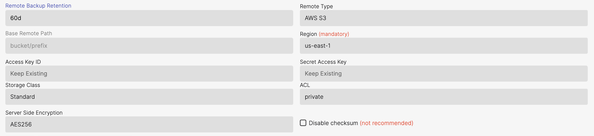

## What is S3

Amazon Simple Storage Service (Amazon S3) is an object storage service that offers industry-leading scalability, data availability, security, and performance. Read more at [Amazon S3](https://docs.aws.amazon.com/AmazonS3/latest/userguide/Welcome.html)

When selecting AWS S3 as a remote option there are a few fields that are mandatory the rest are optional.

S3 allows any valid UTF-8 string as a key.



#### Remote Backup Retention

The amount of days that backup files will be kept in the remote storage provider location. 
After this amount of days the file that are older will be removed.

#### Base Remote Path

This is the name of the storage buckets, you can also add subfolders if using shared storage buckets or saving multiple clusters to the same bucket. by default AxonOps will save the backups to /bucket/folder/org/clustertype/clustername/host-id/

The org/clustertype/clustername/host-id/ will match the top breadcrump navigation in your AxonOps Dashboard.

#### Region

This is a drop down selection of all the AWS regions that are available for your AWS account.

#### Authentication Methods

**IAM Role (Recommended)**

The recommended approach is to use IAM roles attached to your EC2 instances. This method is more secure as it doesn't require storing credentials:

1. Create an IAM role with the necessary S3 permissions (see policy below)
2. Attach the role to your EC2 instances running Cassandra
3. Leave the Access Key ID and Secret Access Key fields empty in AxonOps
4. AxonOps will automatically use the instance's IAM role credentials

This approach provides:
* No credential management or rotation needed
* More secure - no long-lived access keys
* Automatic credential refresh
* Follows AWS security best practices

**Access Key ID and Secret Access Key (Alternative)**

If IAM roles are not available (e.g., on-premises installations), you can use explicit credentials:
* This is the standard AWS Access and Secret key that are associated with an IAM user
* These credentials should be protected and rotated regularly
* Only use this method when IAM roles are not an option

#### Required IAM Permissions

Whether using IAM roles or user credentials, the following permissions are needed for accessing the S3 buckets:

For IAM roles, use this policy (attach to the role, not the bucket):

```json
{
  "Version": "2012-10-17",
  "Statement": [
    {
      "Sid": "AxonOpsBackupPermissions",
      "Effect": "Allow",
      "Action": [
        "s3:ListBucket",
        "s3:GetBucketLocation",
        "s3:DeleteObject",
        "s3:GetObject",
        "s3:PutObject",
        "s3:PutObjectAcl"
      ],
      "Resource": [
        "arn:aws:s3:::<BUCKETNAME>",
        "arn:aws:s3:::<BUCKETNAME>/*"
      ]
    }
  ]
}
```

Replace `<BUCKETNAME>` with your actual bucket name. For bucket naming rules, see [AWS documentation](https://docs.aws.amazon.com/AmazonS3/latest/userguide/bucketnamingrules.html).

For cross-account access or when using IAM users, you may need to configure a bucket policy as well.

#### Storage Class

Amazon S3 offers a range of storage classes that you can choose from based on the performance, data access, resiliency, and cost requirements of your workloads. S3 storage classes are purpose-built to provide the lowest cost storage for different access patterns.

Please pick from the available AWS Storage classes:

* Glacier
* Glacier Deep Archive
* Intelligent-Tiering
* One Zone Infrequent Access
* Reduced Redundancy
* Standard
* Stadard Infrequent Access

For more inforamtion on S3 Storage classes please go [here](https://aws.amazon.com/s3/storage-classes/)

#### ACL

Amazon S3 access control lists (ACLs) enable you to manage access to buckets and objects. Each bucket and object has an ACL attached to it as a subresource. It defines which AWS accounts or groups are granted access and the type of access. When a request is received against a resource, Amazon S3 checks the corresponding ACL to verify that the requester has the necessary access permissions.

Please pick from the available AWS ACL's:

* Private
* Public Read
* Public Read-Write
* Authenticated Read
* Bucket Owner Read
* Bucket Owner Full Control

For more inforamtion on S3 ACL's please go [here](https://docs.aws.amazon.com/AmazonS3/latest/userguide/acl-overview.html#canned-acl)

#### Server Side Encryption

The server-side encryption algorithm used when storing this object in S3.

#### Disable Checksum

Normally AxonOps Backups will check that the checksums of transferred files match, and give an error "corrupted on transfer" if they don't. If you disable this then the checksum will be ignored if there are differences. This is not advised. 


