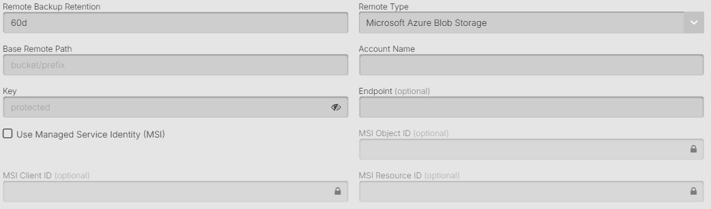

## What is Azure Blob Storage

Azure Blob Storage is Microsoft's object storage solution for the cloud. Blob storage is optimized for storing massive amounts of unstructured data, such as text or binary data. Azure Blob Storage is ideal for serving images or documents, storing files for distributed access, streaming video and audio, storing data for backup and restore, disaster recovery, and archiving. Read more at [Azure Blob Storage documentation](https://docs.microsoft.com/en-us/azure/storage/blobs/)

When selecting Azure Blob Storage as a remote option there are several fields that need to be configured.



#### Remote Backup Retention

The amount of days that backup files will be kept in the remote storage provider location. 
After this amount of days the files that are older will be removed.

#### Base Remote Path

This is the name of the container, you can also add subfolders if using shared containers or saving multiple clusters to the same container. By default AxonOps will save the backups to `/container/folder/org/clustertype/clustername/host-id/`

The org/clustertype/clustername/host-id/ will match the top breadcrumb navigation in your AxonOps Dashboard.

Note: Azure container names must be lowercase and follow specific naming rules. See [Azure naming conventions](https://docs.microsoft.com/en-us/azure/storage/blobs/storage-blobs-introduction#containers)

#### Storage Account Name

The name of your Azure Storage account. This is a globally unique name that identifies your storage account. It must be between 3 and 24 characters, containing only lowercase letters and numbers.

#### Authentication Method

AxonOps supports multiple authentication methods for Azure Blob Storage:

**Managed Identity (Recommended)**

The recommended approach is to use Azure Managed Identities for your Azure VMs. This method is more secure as it doesn't require storing credentials:

1. Enable system-assigned or user-assigned managed identity on your Azure VMs
2. Grant the managed identity appropriate permissions on the storage account (see RBAC section below)
3. Leave all authentication fields empty in AxonOps
4. AxonOps will automatically use the VM's managed identity

This approach provides:
* No credential management or rotation needed
* More secure - no keys or secrets to protect
* Automatic token refresh
* Follows Azure security best practices
* Works with both system and user-assigned identities

**Storage Account Key (Alternative)**
* Uses the primary or secondary key from your storage account
* Only use when managed identities are not available (e.g., on-premises)
* Found in Azure Portal > Storage Account > Access Keys
* Full access to the storage account

**Shared Access Signature (SAS)**
* Provides limited access with specific permissions
* Time-bound access tokens
* Good for temporary or restricted access

**Azure Active Directory (OAuth)**
* Uses Azure AD service principals
* Suitable when managed identities cannot be used
* Requires app registration and secret management

#### Required Permissions (RBAC)

When using Managed Identity, assign one of these roles to the identity:
* **Storage Blob Data Contributor** - Recommended for backup operations
* **Storage Blob Data Owner** - If you need full control
* Or create a custom role with these permissions:
  - `Microsoft.Storage/storageAccounts/blobServices/containers/read`
  - `Microsoft.Storage/storageAccounts/blobServices/containers/write`
  - `Microsoft.Storage/storageAccounts/blobServices/containers/blobs/read`
  - `Microsoft.Storage/storageAccounts/blobServices/containers/blobs/write`
  - `Microsoft.Storage/storageAccounts/blobServices/containers/blobs/delete`

To assign the role:
1. Go to your Storage Account in Azure Portal
2. Select "Access Control (IAM)"
3. Click "Add role assignment"
4. Select the appropriate role
5. Assign to your VM's managed identity

#### Storage Account Key

When using key authentication (not recommended), provide either the primary or secondary key from your storage account. These keys provide full access to your storage account and should be protected accordingly.

To find your keys:
1. Navigate to your storage account in the Azure Portal
2. Select "Access keys" under Security + networking
3. Copy either key1 or key2

#### SAS Token

When using SAS authentication, provide a SAS token with appropriate permissions. The token should have at least:
* Read permission
* Write permission
* Delete permission
* List permission

Example SAS token format:
```
?sv=2020-08-04&ss=b&srt=sco&sp=rwdlacx&se=2024-12-31T23:59:59Z&st=2023-01-01T00:00:00Z&spr=https&sig=...
```

#### Access Tier

Azure Blob Storage offers different access tiers optimized for different data access patterns:

* **Hot**: For frequently accessed data
  * Highest storage costs, lowest access costs
  * Best for active backups

* **Cool**: For infrequently accessed data (30+ days)
  * Lower storage costs, higher access costs
  * Good for recent backups

* **Archive**: For rarely accessed data (180+ days)
  * Lowest storage costs, highest access costs
  * Requires rehydration before access
  * Best for compliance/long-term storage

For backup scenarios:
* Use **Hot** tier for the most recent backups
* Use **Cool** tier for backups older than 30 days
* Use **Archive** tier for long-term retention

#### Blob Type

Azure supports different blob types:
* **Block Blobs**: Optimized for upload of large amounts of data (recommended for backups)
* **Page Blobs**: Optimized for random read/write operations
* **Append Blobs**: Optimized for append operations

For Cassandra backups, **Block Blobs** are recommended.

#### Redundancy Options

While not directly configured in AxonOps, your storage account's redundancy affects availability:
* **LRS** (Locally Redundant Storage): 3 copies in one region
* **ZRS** (Zone Redundant Storage): 3 copies across availability zones
* **GRS** (Geo-Redundant Storage): 6 copies across two regions
* **GZRS** (Geo-Zone Redundant Storage): Combines ZRS and GRS

#### Encryption

Azure provides several encryption options:
* **Microsoft-managed keys**: Default encryption (automatic)
* **Customer-managed keys**: Use your own keys via Azure Key Vault
* **Infrastructure encryption**: Double encryption at rest

#### Network Configuration

Ensure your Azure Storage account allows connections from AxonOps:
* **Public endpoint**: Accessible from anywhere (check firewall rules)
* **Private endpoint**: Requires VNet connectivity
* **Service endpoints**: Restricts access to specific VNets

#### Disable Checksum

Normally AxonOps Backups will check that the checksums of transferred files match, and give an error "corrupted on transfer" if they don't. If you disable this then the checksum will be ignored if there are differences. This is not advised.

### Best Practices

1. **Use SAS Tokens**: Prefer SAS tokens over account keys for better security
2. **Enable Soft Delete**: Protect against accidental deletion
3. **Set Lifecycle Policies**: Automatically move old backups to cooler tiers
4. **Monitor Costs**: Use Azure Cost Management to track storage expenses
5. **Enable Logging**: Use Azure Storage Analytics for audit trails

### Performance Optimization

1. **Use Premium Storage**: For performance-critical restore operations
2. **Enable Large File Shares**: For better throughput
3. **Optimize Block Size**: Larger blocks for large files
4. **Parallel Uploads**: Configure appropriate parallelism
5. **CDN Integration**: For geo-distributed restore needs

### Cost Management

1. **Reserved Capacity**: Purchase reserved storage for predictable workloads
2. **Lifecycle Management**: Auto-transition to cheaper tiers
3. **Regional Selection**: Choose regions with lower costs
4. **Monitor Transactions**: Each operation incurs a small cost
5. **Cleanup Old Backups**: Remove unnecessary backups

### Troubleshooting

1. **Authentication Failed**: Verify account name and key/SAS token
2. **Container Not Found**: Check container name (must be lowercase)
3. **Access Denied**: Verify SAS permissions or firewall rules
4. **Throttling**: Check storage account limits and scale if needed
5. **Network Errors**: Verify connectivity and firewall settings