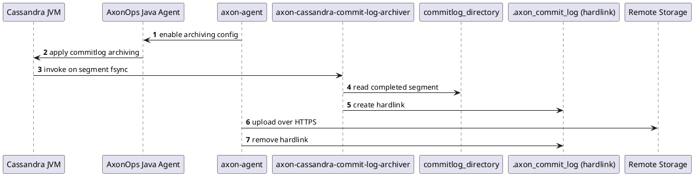

# Commit Log Archiving

Commit log archiving extends backups with point-in-time recovery. When enabled, axon-agent collects commit log segments and uploads them to the configured remote storage. This allows you to restore to a specific moment between two backup snapshots.

## How it works

AxonOps enables and manages commit log archiving dynamically through the Cassandra JVM agent and axon-agent binary.

1. **AxonOps enables archiving dynamically**
    The AxonOps Java agent (running inside the Cassandra JVM) receives a command from axon-agent and applies commit log archiving configuration at runtime.

!!! info "Standard Cassandra behavior (for reference)"
    Without AxonOps, operators must edit `$CASSANDRA_HOME/conf/commitlog_archiving.properties` and restart the node for changes to take effect.

2. **Commit log segment completion triggers archiving**
    When a commit log segment is completed and fsynced, Cassandra invokes `axon-cassandra-commit-log-archiver`.

3. **Hardlink staging**
    The archiver creates a hardlink in `commitlog_directory/.axon_commit_log/`. Cassandra may delete the original segment, but AxonOps keeps the hardlinked copy alive and manages its lifecycle.

4. **Remote upload and cleanup**
    axon-agent uploads the hardlinked segment to the configured remote storage. After a successful upload, the hardlink is removed.

## When to use it

Use commit log archiving if you need:

- Point-in-time recovery (PITR)
- Protection against operator error between backups
- A smaller recovery window than snapshot frequency

## Requirements

- Remote backup storage configured and reachable
- Sufficient remote storage space for commit logs
- Network bandwidth to upload new segments continuously

## Enable commit log archiving

Commit log archiving is configured as part of Point-in-Time Restore (PITR).

Follow:

- [Configure Commitlog Archiving](../../../pitr/configuration.md)
- [Restore from Point-in-Time](../../../pitr/restore.md)

## Operational notes

- Archiving is remote-only. Local-only backups do not support PITR.
- Commit log upload failures surface as backup warnings and should be investigated promptly.
- Keep retention aligned with your recovery objectives (RPO/RTO).
