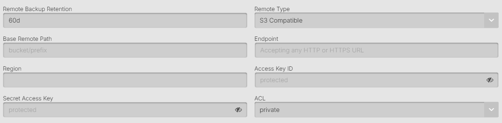

## What is Generic S3

Generic S3 (S3 Compatible) storage refers to object storage services that implement the Amazon S3 API but are not provided by AWS. Many cloud providers and storage solutions offer S3-compatible APIs, including MinIO, Ceph, DigitalOcean Spaces, Wasabi, Backblaze B2, and many others. This allows you to use the same S3 protocol with different storage providers.

When selecting Generic S3 as a remote option there are several fields that need to be configured.

#### Remote Backup Retention

The amount of days that backup files will be kept in the remote storage provider location. 
After this amount of days the files that are older will be removed.

#### Base Remote Path

This is the name of the storage bucket, you can also add subfolders if using shared storage buckets or saving multiple clusters to the same bucket. By default AxonOps will save the backups to `/bucket/folder/org/clustertype/clustername/host-id/`

The org/clustertype/clustername/host-id/ will match the top breadcrumb navigation in your AxonOps Dashboard.

#### Endpoint URL

The endpoint URL for your S3-compatible storage service. This varies by provider:
* MinIO: `https://play.min.io` or your self-hosted URL
* DigitalOcean Spaces: `https://{region}.digitaloceanspaces.com`
* Wasabi: `https://s3.{region}.wasabisys.com`
* Backblaze B2: `https://s3.{region}.backblazeb2.com`
* Ceph: Your Ceph RadosGW endpoint

#### Region

The region where your S3-compatible storage is located. Some providers use AWS-style regions (us-east-1, eu-west-1), while others may use their own region naming conventions. Check your provider's documentation for the correct region identifier.

#### Access Key ID and Secret Access Key

These are the credentials provided by your S3-compatible storage provider:
* **Access Key ID**: The public identifier for your storage account
* **Secret Access Key**: The private key used to sign requests

These credentials should have the following permissions on the bucket:
* ListBucket
* GetObject
* PutObject
* DeleteObject
* GetBucketLocation

#### Path Style Access

S3-compatible storage services support two URL styles:
* **Virtual-hosted style**: `https://bucket.endpoint.com/object` (default for AWS S3)
* **Path style**: `https://endpoint.com/bucket/object`

Enable path style access if your provider requires it. Many S3-compatible services like MinIO require path style access.

#### SSL/TLS Settings

Configure the SSL/TLS settings for secure connections:
* **Use SSL**: Enable HTTPS connections (recommended)
* **Verify SSL Certificate**: Validate the server's SSL certificate
* **Skip SSL Verification**: Only use for testing or self-signed certificates (not recommended for production)

#### Storage Class

While S3-compatible services may support storage classes, the available options vary by provider:
* Standard (most common)
* Provider-specific classes (check your provider's documentation)

If unsure, leave this as "Standard" or consult your storage provider's documentation.

#### ACL (Access Control List)

The access control settings for uploaded objects. Common options include:
* **Private**: Only the bucket owner can access (recommended)
* **Public Read**: Anyone can read the objects
* **Authenticated Read**: Authenticated users can read

Most S3-compatible services support standard S3 ACLs, but check your provider's documentation for specifics.

#### Chunk Size

The size of chunks used for multipart uploads (in MB). Larger chunks can improve performance for large files but use more memory. Typical values:
* Minimum: 5 MB
* Default: 8 MB
* Maximum: Varies by provider (often 5 GB)

#### Connection Settings

* **Connection Timeout**: Time to wait for initial connection (seconds)
* **Read Timeout**: Time to wait for data during transfers (seconds)
* **Max Retries**: Number of retry attempts for failed operations

#### Disable Checksum

Normally AxonOps Backups will check that the checksums of transferred files match, and give an error "corrupted on transfer" if they don't. If you disable this then the checksum will be ignored if there are differences. This is not advised.

### Provider-Specific Notes

**MinIO**
* Requires path style access
* Default port is 9000 for self-hosted instances
* Supports all standard S3 operations

**DigitalOcean Spaces**
* Uses virtual-hosted style URLs
* Regions: nyc3, sfo2, sfo3, ams3, sgp1, fra1
* Supports most S3 operations

**Wasabi**
* No egress fees
* Supports virtual-hosted style
* Minimum storage duration of 90 days

**Backblaze B2**
* Requires application keys (not master keys)
* Limited to 1000 buckets per account
* Supports S3 API through specific endpoints

### Troubleshooting

1. **Connection Refused**: Check endpoint URL and port
2. **Access Denied**: Verify access keys and bucket permissions
3. **Invalid Region**: Confirm the region matches your provider's requirements
4. **SSL Errors**: May need to disable certificate verification for self-signed certs
5. **Signature Errors**: Ensure clock synchronization between AxonOps and storage service