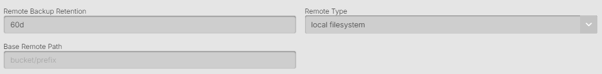

## What is Local Storage

Local Storage in the context of AxonOps remote backups refers to any file system path that is accessible from the Cassandra nodes. This could be a locally attached disk, a network-attached storage (NAS) mount, a SAN volume, or any other file system that appears as a local path to the operating system. This option is useful when you have dedicated backup infrastructure that is mounted on your Cassandra nodes.

When selecting Local Storage as a remote option, configuration is straightforward with minimal fields required.



#### Remote Backup Retention

The amount of days that backup files will be kept in the remote storage provider location. 
After this amount of days the files that are older will be removed.

#### Base Remote Path

This is the absolute file system path where backups will be stored. The path must:
* Be an absolute path (starting with `/` on Linux/Unix or drive letter on Windows)
* Be accessible and writable by the AxonOps agent user
* Have sufficient disk space for storing backups
* Be a valid mounted file system

Examples:
* `/mnt/backups/cassandra`
* `/backup/nfs/cassandra-cluster`
* `/data/backup/production`
* `D:\Backups\Cassandra` (Windows)

By default, AxonOps will create subdirectories under this path following the pattern: `/base/path/org/clustertype/clustername/host-id/`

The org/clustertype/clustername/host-id/ will match the top breadcrumb navigation in your AxonOps Dashboard.

### Common Use Cases

**Network Attached Storage (NAS)**
* Mount NFS, SMB/CIFS, or other network shares
* Centralized backup storage across multiple nodes
* Example: `/mnt/nas/cassandra-backups`

**Storage Area Network (SAN)**
* High-performance block storage
* Often used in enterprise environments
* Example: `/san/backup/cassandra`

**Dedicated Backup Volumes**
* Separate disk or volume for backups
* Isolates backup I/O from database operations
* Example: `/backup/cassandra`

**Shared File Systems**
* GlusterFS, CephFS, or other distributed file systems
* Provides redundancy at the storage layer
* Example: `/gluster/backups/cassandra`

### Permissions and Ownership

Ensure the AxonOps agent user has appropriate permissions:
```bash
# Check current permissions
ls -la /path/to/backup/directory

# Grant permissions if needed (example)
sudo chown -R axonops:axonops /path/to/backup/directory
sudo chmod -R 750 /path/to/backup/directory
```

### Mount Options

For network-mounted file systems, consider these mount options:
* **NFS**: `rw,hard,intr,rsize=1048576,wsize=1048576`
* **SMB/CIFS**: `rw,uid=axonops,gid=axonops,file_mode=0750,dir_mode=0750`
* **Auto-mount**: Configure in `/etc/fstab` for persistence

### Performance Considerations

1. **I/O Impact**: Local storage backups can impact disk I/O on the node
2. **Network Bandwidth**: For network mounts, ensure adequate bandwidth
3. **Disk Space**: Monitor available space to prevent backup failures
4. **File System Choice**: ext4, XFS, or ZFS are recommended for Linux
5. **Mount Options**: Use appropriate options for your storage type

### Monitoring and Maintenance

1. **Disk Space Monitoring**: Set up alerts for low disk space
2. **Mount Health**: Monitor that network mounts remain accessible
3. **Backup Verification**: Regularly verify backup integrity
4. **Cleanup**: Ensure retention policies are working correctly
5. **Performance Metrics**: Track backup duration and throughput

### Best Practices

1. **Dedicated Storage**: Use dedicated backup storage separate from Cassandra data
2. **Redundancy**: Ensure the storage itself has redundancy (RAID, replication)
3. **Regular Testing**: Periodically test restore procedures
4. **Documentation**: Document mount points and dependencies
5. **Automation**: Automate mount checks and space monitoring

### Advantages

* **Simple Configuration**: No cloud credentials or complex setup
* **Fast Transfers**: No network latency for local disks
* **Cost Effective**: No cloud storage fees
* **Full Control**: Complete control over storage infrastructure
* **Predictable Performance**: Consistent I/O characteristics

### Limitations

* **Single Point of Failure**: Unless using redundant storage
* **Manual Management**: Requires managing disk space and mounts
* **No Geographic Distribution**: Backups in same location as cluster
* **Scaling Challenges**: Must provision sufficient storage upfront

### Troubleshooting

1. **Permission Denied**: Check file system permissions and ownership
2. **No Space Left**: Monitor and manage disk space usage
3. **Mount Not Found**: Verify mount points are active and accessible
4. **Slow Performance**: Check disk I/O metrics and mount options
5. **Stale Mounts**: For network mounts, check connectivity and remount if needed

### Disable Checksum

Normally AxonOps Backups will check that the checksums of transferred files match, and give an error "corrupted on transfer" if they don't. If you disable this then the checksum will be ignored if there are differences. This is not advised, especially for network-mounted storage where corruption is more likely.