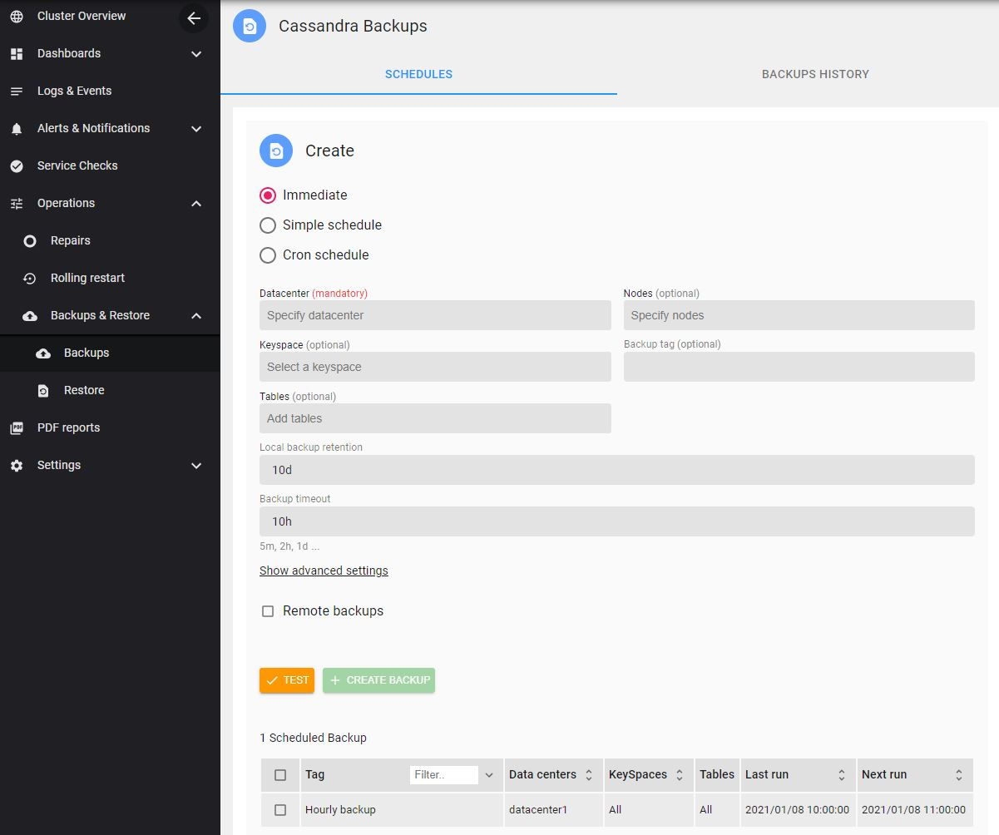
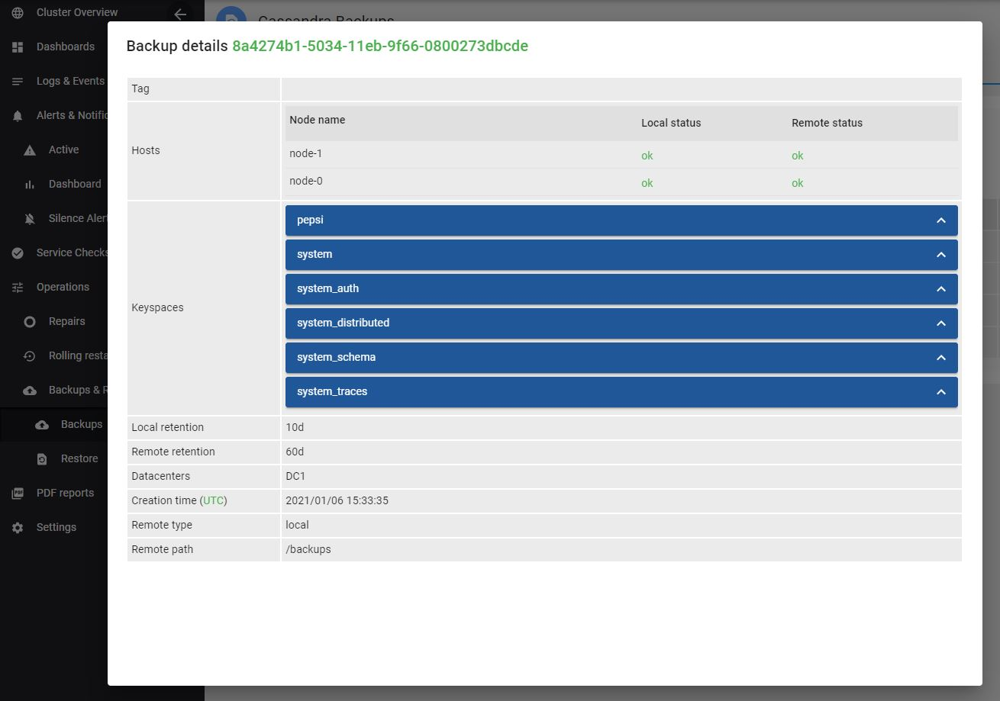
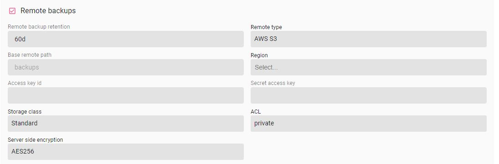

AxonOps provide scheduled backup and restore functionality for your Cassandra data.

The functionality is accessible via ***Operations > Backups***

!!! infomy 

    

## Scheduled backup

You can initiate three types of scheduled backup:

* Immediate scheduled backup: these will trigger immediately **once**

* Simple scheduled backup: these will trigger based on the selected schedule **repeatedly**

!!! infomy 

    

* Cron schedule backup: Same as **simple scheduled backup** but the schedule will be based on a Cron expression

!!! infomy 

    

> The following capture presents two backups, a local only and a local and remote backup:

!!! infomy 

    

> And the details of the local and remote backup:

!!! infomy 

    

###  Remote backups 

> Note that **axonops** user will need read access on Cassandra data folders to be able to perform a remote backup.

The available remote options are:

* AWS S3
* Google Cloud Storage
* Microsoft Azure Blob Storage
* SFTP/SSH
* local filesystem

example of the AWS S3 remote interface:

!!! infomy 

    

