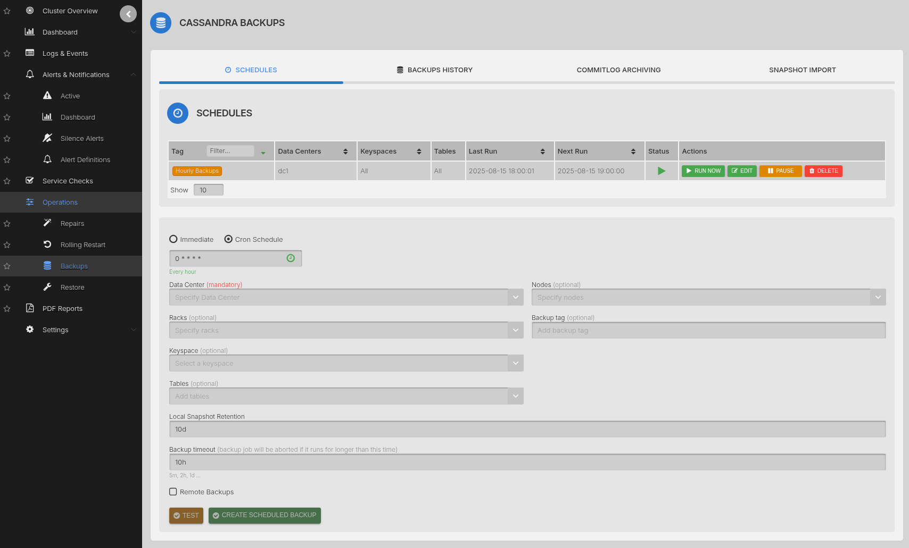
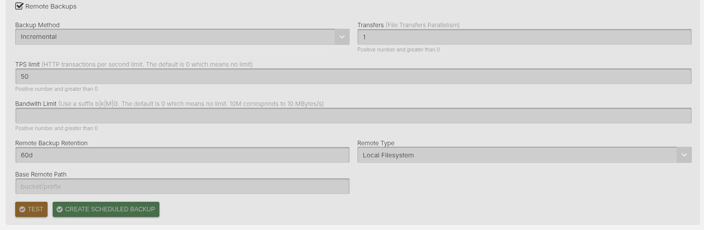

# Scheduled Backups

AxonOps provides scheduled backup functionality for your Cassandra data to local and remote storage options.

The Backup feature is accessible via ***Operations > Backups***.

## Scheduled Backups

You can initiate two types of scheduled backup:

* Immediate backup: triggers a backup immediately, once.

* Cron schedule backup: triggered based on the selected schedule and based on a Cron expression.

## Remote Backups

Backups can be created and stored locally and/or remotely.

Backups can be stored to:

* AWS S3
* Google Cloud Storage
* Local filesystem
* Microsoft Azure Blob Storage
* S3 Compatible storage systems
* SFTP/SSH servers

