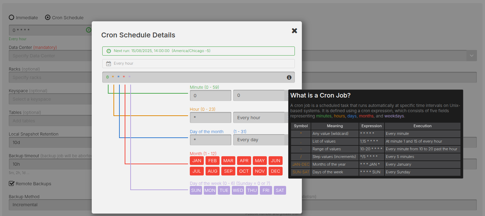

AxonOps provides scheduled backup funtionality for your Cassandra data to local and remote storage options.

The Backup feature is accessible via ***Operations > Backups***.

!!! infomy
    

## Scheduled Backups

You can initiate three types of scheduled backup:

* Immediate scheduled backup: will trigger backup immediately **once**.

* Cron schedule backup: triggered based on the selected schedule and based on a Cron expression.

!!! infomy
    

## Remote Backups

Backups can be created and stored locally and/or remotely.

!!! infomy
    

Backups can be stored to:

* AWS S3
* Google Cloud Storage
* Local filesystem
* Microsoft Azure Blog Storage
* S3 Compatible storage systems
* SFTP/SSH servers

!!! infomy
    
