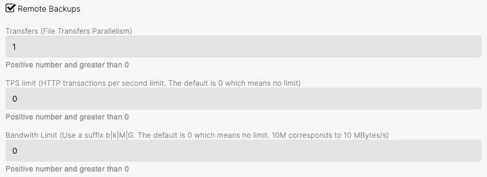

###  Remote backups 

> Note that **axonops** user will need read access on Cassandra data folders to be able to perform a remote backup.

When selecting Remote backups there is some basic config presets.

#### Transfers (File Transfer Parallelism)

The number of file transfers to run in parallel. It can be beneficial to set this to a smaller number if the remote is giving timeouts. You can set this to a bigger number or leave it at 0  if you have lots of bandwidth and a fast remote.

#### TPS Limit 

If you are getting errors from the cloud storage provider then you need to start adjusting this limit.

The default is 0

Storage provider errors consist of getting you banned or imposing rate limits.

A transaction is any of but not limited to, PUT/GET/POST calls to the Storage backend. 

Different Storage providers have different limits. 

* Amazon S3 has a limit of 5,500 GET requests per second per partitioned prefix.[More here](https://docs.aws.amazon.com/athena/latest/ug/performance-tuning-s3-throttling.html)
* Google Cloud Storage has an approximate limit of 1,000 READ and 5,000 WRITE requests per second.[More here](https://cloud.google.com/storage/docs/request-rate)
* Azure Blob Storage has a limit of 20,000 requests per second per storage account. [More here](https://learn.microsoft.com/en-us/azure/storage/common/scalability-targets-standard-account?toc=%2Fazure%2Fstorage%2Fblobs%2Ftoc.json)

#### Bandwidth Limit

This will allow you to set a limit on how much data you want to transfer to your Storage provider during backups. 
Note that the units are Byte/s, not bit/s. Typically connections are measured in bit/s - to convert divide by 8. For example, let's say you have a 10 Mbit/s connection and you wish AxonOps to use half of it - 5 Mbit/s. 
You will calculate the limit value as 5MB/8 = 0.625 MiB/s.
The value you would set it 0.625

In most modern storage systems the value is not normally this low but if you have a VPN Gateway connection setup between an on-premise cluster and a storage provider that has a 100MB connection you could potentially limit how much of the pipe gets used by backups. 

#### The available remote options are:

* AWS S3
* Google Cloud Storage
* local filesystem
* Microsoft Azure Blob Storage
* S3 Compatible
* SFTP/SSH
