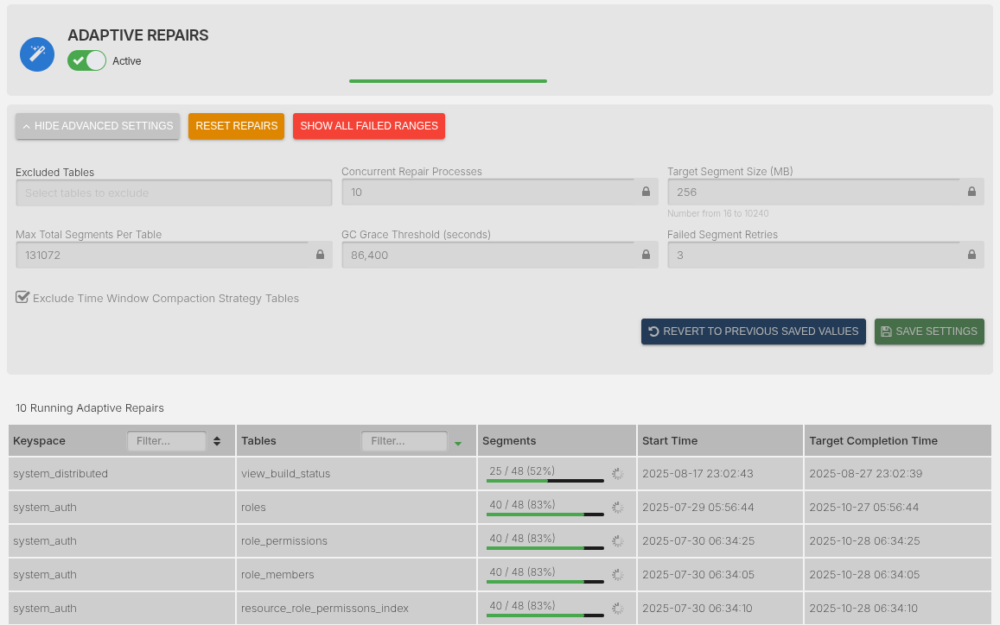
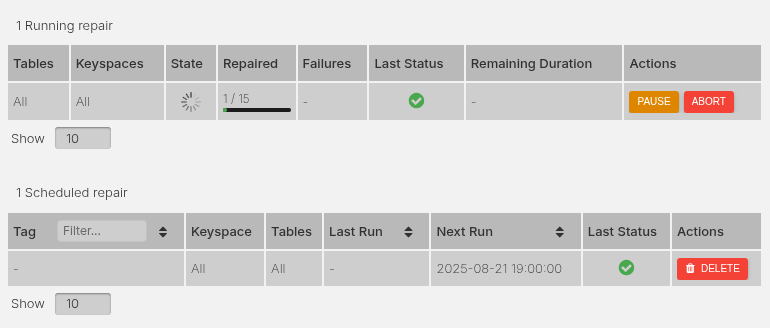
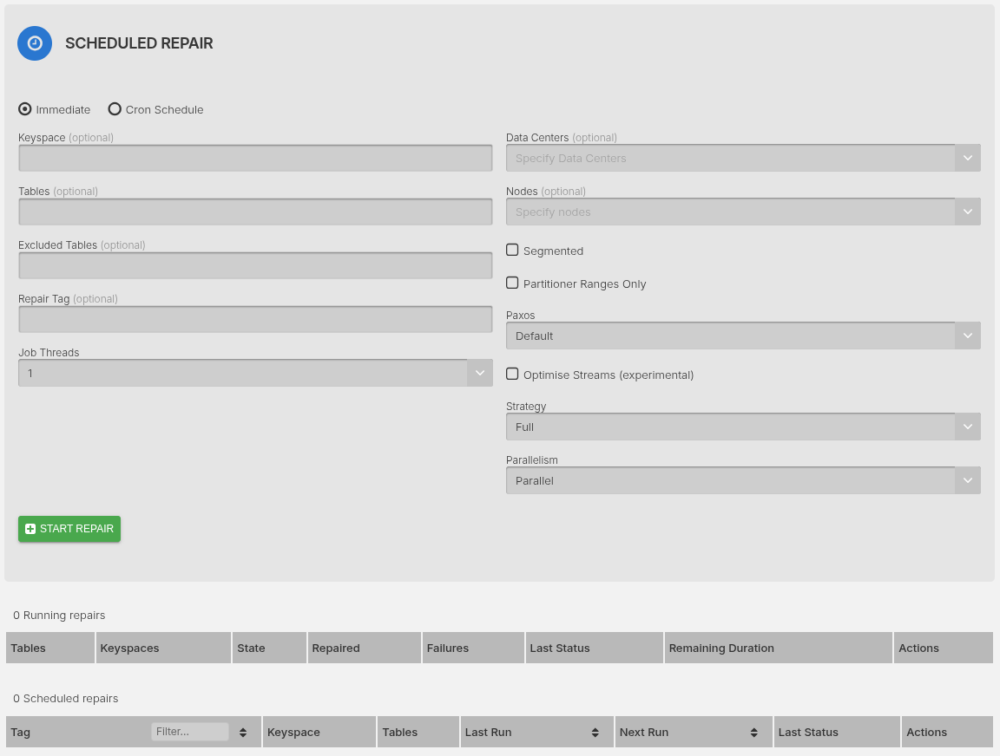
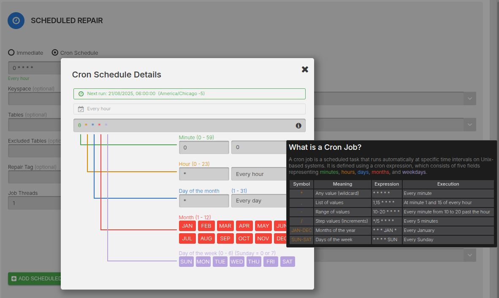

Repairs must be completed regularly to maintain Cassandra nodes.

AxonOps provides two mechanisms to ease management of repairs in Cassandra:

* Adaptive Repair Service
* Scheduled Repairs

## Adaptive Repair Service

Since AxonOps collects performance metrics and logs, we built an "Adaptive" repair system which regulates the velocity (parallelism and pauses between each subrange repair) based on performance trending data. The regulation of repair velocity takes input from various metrics including:

* CPU utilization
* Query latencies
* Cassandra thread pools pending statistics
* I/O wait percentage
* Tracking of the repair schedule based on `gc_grace_seconds` for each table

The idea of this is to achieve the following:

* Completion of repair within `gc_grace_seconds` of each table.
* Repair process does not affect query performance.
* In essence, the adaptive repair regulator slows down the repair velocity when it detects an increase in load and speeds up to catch up with the repair schedule when resources are more readily available.
* This mechanism does not require JMX access. The adaptive repair service running on AxonOps server orchestrates and issues commands to the agents over the existing connection.

!!! infomy
    
    

From a user's point of view there is only a single switch to enable this service. Keep this enabled and AxonOps will take care of the repair of all tables for you. 

You can, however, customize the following:

* Exclude tables
  
    Skip specific tables from automatic repair

* Parallel processing
  
    Set how many tables to repair simultaneously

* Segment size
  
    Splits each table into segments of up to this size and repairs each segment in turn.

* GC grace threshold

    If a table has a gc grace lesser than the specified value, the table will be ignored by the adaptive repair service.

* Max total segments per table

    Maximum number of segments to split each table into for repair (range: 1 to 1,000,000). Larger tables are divided into more segments to restrict the repair time of each segment.

### Increasing Data Consistency

To keep tables as up-to-date as possible we recommend both:

* Increasing the `Concurrent Repair Processes` to be greater than the total number of tables in the cluster.
* Reducing the `Target Segment Size` to generate fewer repair requests.

## Scheduled Repairs

You can initiate two types of scheduled repairs with AxonOps.

!!! infomy 

    
    

The above screenshot showcases a running repair that has been initiated immediately and a scheduled repair that is scheduled for 12:00 AM UTC.

### Immediate Repairs

These will trigger immediately **once**.

!!! infomy 

    

### Cron Scheduled Repairs

These will trigger based on the selected schedule **repeatedly**.

!!! infomy 

    
