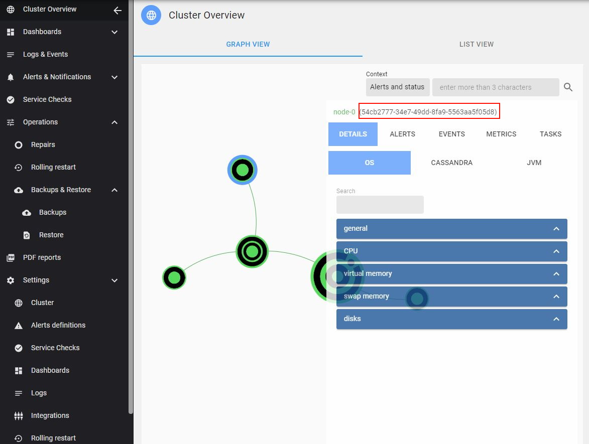
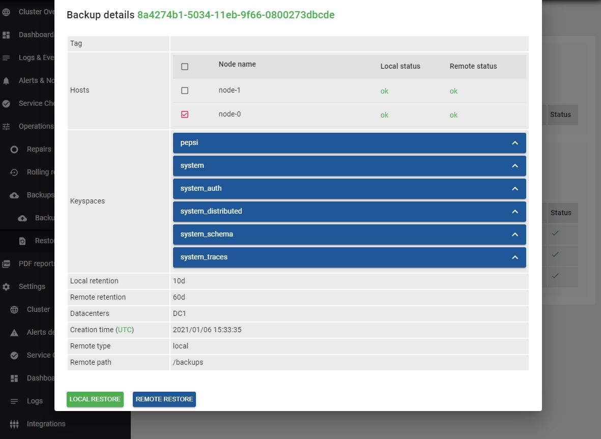

AxonOps provides a restore functionnality from previous Cassandra snapshots within the `Operations > Backups & Restore > Restore` menu.

!!! infomy 

    [](/img/cass_backups/restore.JPG)


> Note that **axonops** user will need temporary write access on Cassandra data folders to be able to proceed the restoration.

To restore Cassandra, click on a relevant backup.


This will provide the details of that backup and the ability to start the restoration by clicking the `LOCAL RESTORE` or `REMOTE RESTORE` button depending on if you prefer
to restore from the local snapshot or the remote one (if you have one).
You can also select which nodes you would like to restore on via the checkboxes in the Hosts list.

!!! infomy 

    [](/img/cass_backups/restore1.JPG)

## Restore on a replacement node
Use this procedure when a node in the Cassandra cluster needs to be replaced.

> Make sure that Cassandra is not running while you are doing the restoration on the replacement node and that Cassandra configuration is identical to the dead node.

First you'll need to retrieve the ***axon-agent hostID*** of the dead node.
You'll find it in the cluster overview by selecting a node:

!!! infomy 

    [](./hostID2.JPG)

Once you get the hostID of the dead node, you'll start ***axon-agent*** on the new node passing the previous hostID as an env var:
``` bash
AXON_AGENT_HOSTID=54cb2777-34e7-49dd-8fa9-5563aa5f05d8 /usr/share/axonops/axon-agent
```

Once the agent is started and connected to axon-server with the previous hostID, you'll navigate to `Operations > Backups & Restore > Restore`; select the backup you'd like to restore from; select the replacement node via the red checkbox and click ***REMOTE RESTORE***.
This will restore the data from the remote location to the selected node. 
> Note that **axonops** user will need write access on Cassandra data folders to be able to proceed the restoration.

!!! infomy 

    [](./restore_replace.JPG)

Once the restore process is finished, you can start Cassandra on the replacement node.

