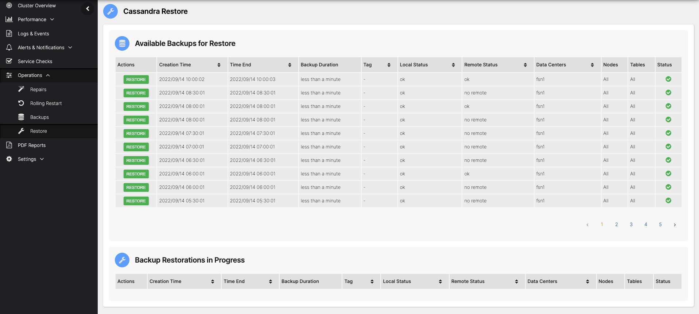

# Overview

AxonOps provides the ability to restore from local snapshots and remote backups.

The Restore feature is accessible via **Operations > Restore**.

> Note that the AxonOps user needs temporary write access to Cassandra data folders to perform the restore.

To restore Cassandra, click the backup you want to restore.

This provides the backup details and lets you start the restoration by clicking **LOCAL RESTORE** or **REMOTE RESTORE**, depending on whether you want to restore from the local snapshot or the remote backup (if remote backups are configured).
Here you can also select a subset of nodes to restore via the checkboxes in the Nodes list.

Follow the links below for detailed restore scenarios:

[Restore a single node - same IP address](restore-node-same-ip.md)

[Replace a node - different IP address](restore-node-different-ip.md)

[Restore whole cluster - same IP addresses](restore-cluster-same-ip.md)

[Restore whole cluster - different IP addresses](restore-cluster-different-ips.md)
