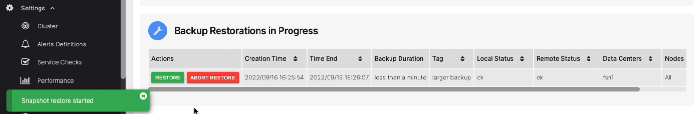

# Restore a whole cluster from a remote backup

*Follow this procedure when you have lost all nodes in a cluster but they have been recreated in the same cluster 
topology (Cluster, DC and rack names are all the same and the same number of nodes in each) and the replacement
nodes have the same IP addresses as the original cluster.*

Ensure that Cassandra is stopped on all nodes and that its data directories are empty

```bash
sudo systemctl stop cassandra
sudo rm -rf /var/lib/cassandra/commitlog/* /var/lib/cassandra/data/* /var/lib/cassandra/hints/* /var/lib/cassandra/saved_caches/*
```

Allow the AxonOps user to write to the Cassandra data directory
```bash
sudo chmod -R g+w /var/lib/cassandra/data
```

> These commands assume you are storing the Cassandra data in the default location `/var/lib/cassandra/`, you will
> need to change the paths shown if your data is stored at a different location

Start the AxonOps agent on all nodes
```bash
sudo systemctl start axon-agent
```

Now open the Restore page in the AxonOps Dashboard by going to ***Operations > Restore***

!!! infomy

    [](../../../img/cass_backups/restore.png)

Choose the backup you wish to restore from the list and click the `RESTORE` button

This will show the details of the backup and allow you to restore to all nodes or a subset using the checkboxes in the Nodes list.

!!! infomy

    [](../../../img/cass_backups/restore2.png)

Select all nodes in the checkbox list then start the restore by clicking the `REMOTE RESTORE` button.

The restore progress will be displayed in the *Backup Restorations in Progress* list

!!! infomy

    [](../../../img/cass_backups/restores-table.png)

After the restore operation has completed successfully, fix the ownership and permissions on the Cassandra data 
directories on all nodes in the cluster
```bash
sudo chown -R cassandra.cassandra /var/lib/cassandra/data
sudo chmod -R g-w /var/lib/cassandra/data
```

Start cassandra on the restored nodes, starting with the seeds first
```bash
sudo systemctl start cassandra
```
