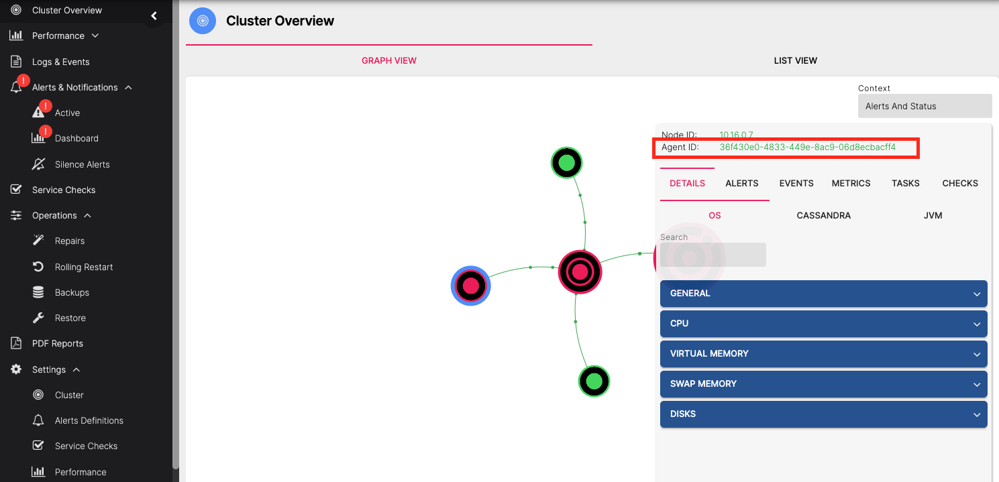

# Replace a node from a remote backup

*Follow this procedure to restore a single Cassandra node from a total loss of all data where the replacement node
has a different IP address from the original.*

> NOTE: Restoring a node from a total loss can only be performed from a remote backup

AxonOps identifies nodes by a unique host ID which is assigned when the agent starts up. In order to restore a backup to
a node with a different IP address you must manually assign the AxonOps host ID of the old node to its new replacement.

You can find the host ID of the old node on the Cluster Overview page of the AxonOps dashboard

!!! infomy

    [](../../../img/cass_backups/hostID.png)

If you still have access to the old server or its data then its host ID can also be found in the file `/var/lib/axonops/hostId`

## Manually configure the AxonOps Agent host ID

Ensure the AxonOps Agent is stopped and clear any data that it may have created on startup

```bash
sudo systemctl stop axon-agent
sudo rm -rf /var/lib/axonops/*
```

Manually apply the old node's host ID on the replacement (replace the host ID shown with your host ID from the previous steps)

```bash
echo '24d0cbf9-3b5a-11ed-8433-16b3c6a7bcc5' | sudo tee /var/lib/axonops/hostId
sudo chown axonops.axonops /var/lib/axonops/hostId
```

Start the AxonOps agent

```bash
sudo systemctl start axon-agent
```

## Restore a backup to the replacement node

Ensure Cassandra is stopped on the new node and that its data directories are all empty
```bash
sudo systemctl stop cassandra
sudo rm -rf /var/lib/cassandra/commitlog/* /var/lib/cassandra/data/* /var/lib/cassandra/hints/* /var/lib/cassandra/saved_caches/*
```

Allow the AxonOps user to write to the Cassandra data directory
```bash
sudo chmod -R g+w /var/lib/cassandra/data
```

> These commands assume you are storing the Cassandra data in the default location `/var/lib/cassandra/`, you will
> need to change the paths shown if your data is stored at a different location

Now open the Restore page in the AxonOps Dashboard by going to ***Operations > Restore***

!!! infomy

    [](../../../img/cass_backups/restore.png)

Choose the backup you wish to restore from the list and click the `RESTORE` button

This will show the details of the backup and allow you to restore to all nodes or a subset using the checkboxes in the Nodes list.

!!! infomy

    [](../../../img/cass_backups/restore1.png)

Ensure only the node you wish to restore is selected in the checkbox list and start the restore by clicking the
`REMOTE RESTORE` button.

The restore progress will be displayed in the *Backup Restorations in Progress* list

!!! infomy

    [](../../../img/cass_backups/restores-table.png)

After the restore has completed successfully, fix the ownership and permissions on the Cassandra data directories
```bash
sudo chown -R cassandra.cassandra /var/lib/cassandra/data
sudo chmod -R g-w /var/lib/cassandra/data
```

Now you can start cassandra on the restored node
```bash
sudo systemctl start cassandra
```

After the replacement node has started up the old IP address may still be visible in Gossip. It should clear out automatically
after a day or two, or you can perform a rolling restart of the cluster to make sure everything is up-to-date.
