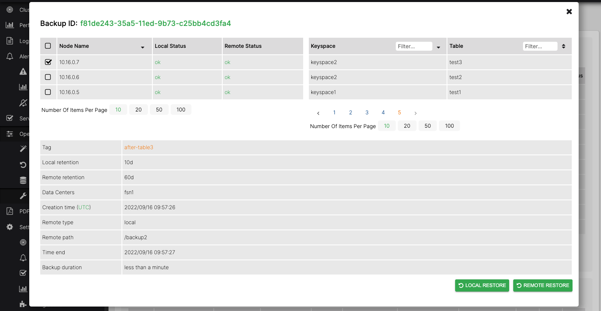

# Restore a single node from a remote backup

*Follow this procedure to restore a single Cassandra node from a total loss of all data where the replacement node
has the same IP address as the original.*

> NOTE: Restoring a node from a total loss can only be performed from a remote backup.

Ensure Cassandra is stopped on the new node and that its data directories are all empty.
```bash
sudo systemctl stop cassandra
sudo rm -rf /var/lib/cassandra/commitlog/* /var/lib/cassandra/data/* /var/lib/cassandra/hints/* /var/lib/cassandra/saved_caches/*
```

Allow the AxonOps user to write to the Cassandra data directory.
```bash
sudo chmod -R g+w /var/lib/cassandra/data
```

> These commands assume you are storing the Cassandra data in the default location `/var/lib/cassandra/`. Update the paths if your data is stored elsewhere.

Start axon-agent if it is not already running.
```bash
sudo systemctl start axon-agent
```

Now open the Restore page in the AxonOps Dashboard by going to **Operations > Restore**.


[](../../../img/cass_backups/restore.png)

Choose the backup you wish to restore from the list and click the `RESTORE` button.

This will show the details of the backup and allow you to restore to all nodes or a subset using the checkboxes in the Nodes list.


[](../../../img/cass_backups/restore1.png)

Ensure only the node you wish to restore is selected in the checkbox list and start the restore by clicking the
`REMOTE RESTORE` button.

The restore progress will be displayed in the *Backup Restorations in Progress* list.


[](../../../img/cass_backups/restores-table.png)


After the restore has completed successfully, fix the ownership and permissions on the Cassandra data directories.
```bash
sudo chown -R cassandra.cassandra /var/lib/cassandra/data
sudo chmod -R g-w /var/lib/cassandra/data
```

Start Cassandra on the restored node.
```bash
sudo systemctl start cassandra
```
