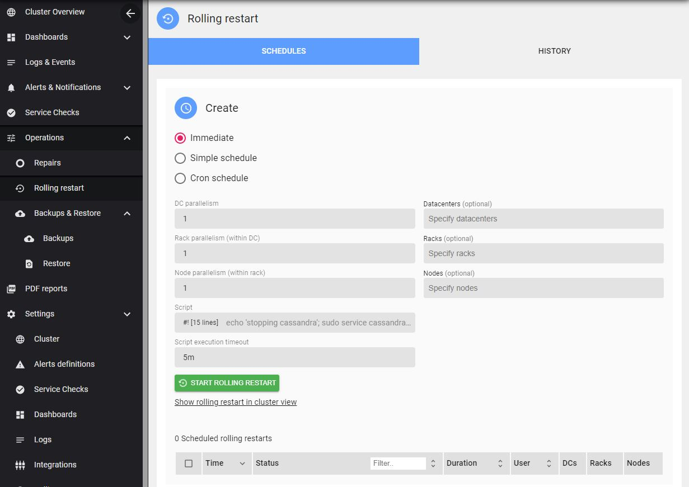

# Overview

AxonOps provides a rolling restart feature for Cassandra.

The feature is accessible via **Operations > Rolling Restart**.




> The **AxonOps** user requires permissions to stop and start the Cassandra service. Add the **AxonOps** user to sudoers, for example:
```bash
#/etc/sudoers.d/axonops
axonops ALL=NOPASSWD: /sbin/service cassandra *, /usr/bin/systemctl * cassandra*
```


You can start an **immediate** rolling restart or **schedule** it.

The **script** field lets you customize the predefined script executed by axon-agent during the restart process.

You can also specify different degrees of parallelism for the restart: **DC**, **Rack**, and **Node**.

For example, to **restart one entire rack** at once across the cluster, set a large **Node parallelism** (greater than the number of nodes in the rack, for example 999).
```bash
DC parallelism: 1
Rack parallelism: 1
Node parallelism: 999
```


To **restart one entire rack across each DC**:
```bash
DC parallelism: 999
Rack parallelism: 1
Node parallelism: 999
```


