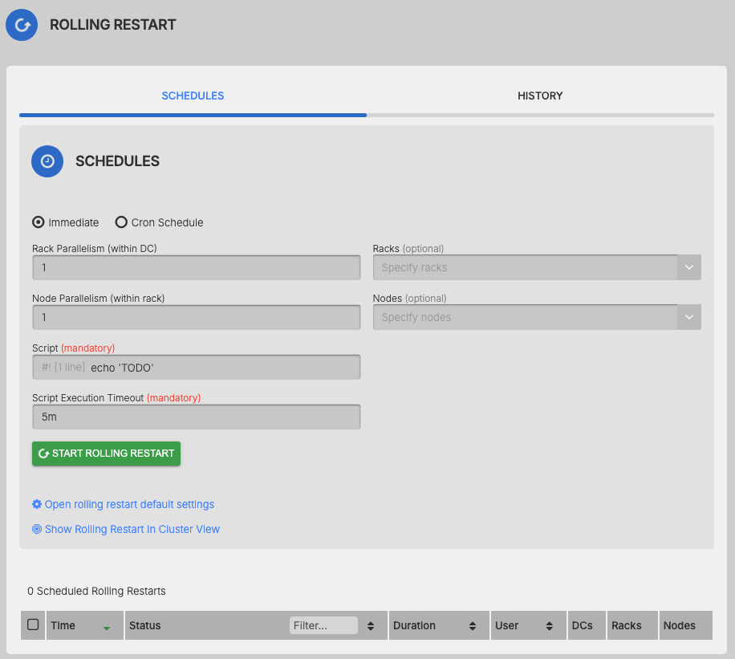

AxonOps provides a rolling restart functionality for Kafka.

The feature is accessible via ***Operations > Rolling Restart***

!!! infomy 

    [](./1.png)

> **axonops** user will require permissions to be able to stop and start Kafka service. To do so you will add **axonops** user in the sudoers with for instance the following permissions:
``` bash
#/etc/sudoers.d/axonops
axonops ALL=NOPASSWD: /sbin/service kafka *, /usr/bin/systemctl * kafka*
```


You can start an **immediate** rolling restart or **schedule** it.

The **script** field let you able to tweak the predefined script executed by **axon-agents** during the restart process.

You can also specify different degree of parallelism for the restart: **DC**, **Rack** and **Node**.

For instance, to **restart one entire rack** at once across the cluster, you can set a large **Node parallelism** (greater than the number of nodes the rack has, ie 999).
``` bash
DC parallelism: 1
Rack parallelism: 1
Node parallelism: 999
```


To **restart one entire rack across each DC**:
``` bash
DC parallelism: 999
Rack parallelism: 1
Node parallelism: 999
```


