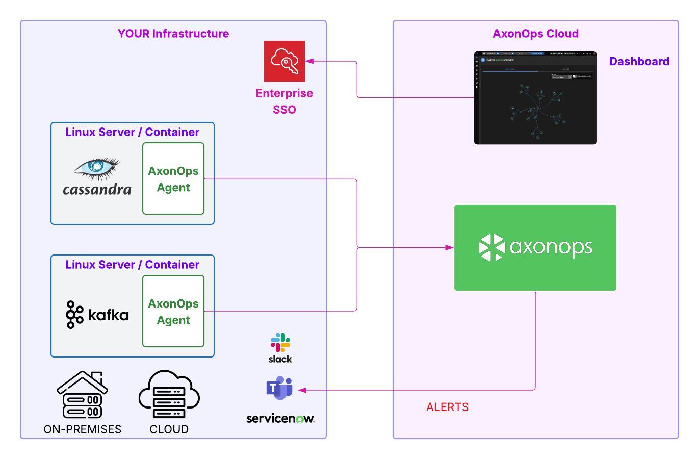

# AxonOps Cloud

AxonOps Cloud is the hosted AxonOps control plane. You run Cassandra and Kafka in your own infrastructure, install the AxonOps agent on those hosts, and AxonOps Cloud provides the dashboards, alerting, and operational workflows.

## How it works

- **You keep your clusters**: Cassandra and Kafka continue to run in your environment (on‑premises or your cloud).
- **You install the agent**: The AxonOps agent collects metrics, logs, and operational signals and sends them to AxonOps Cloud.
- **You get the control plane**: AxonOps Cloud hosts the UI, APIs, alerting, and orchestration so you do not need to run the control plane yourself.

## Control plane and data plane

AxonOps Cloud is the control plane, and your Cassandra/Kafka clusters are the data plane. The agent maintains a secure, *bi‑directional* protocol over HTTPS so the control plane can deliver configurations and operational actions while the data plane remains in your environment.

## What you get

- Centralized dashboards for Cassandra and Kafka
- Kafka management for topics, partitions, ACLs, Kafka Connect, and Schema Registry
- Health checks and alerting integrations
- Repair, backup, and operational workflows
- Log and event visibility
- User management and team access controls

## Security and connectivity

- The AxonOps agent connects outbound from your infrastructure to AxonOps Cloud.
- You do not expose your Cassandra or Kafka nodes to the public internet.
- Data is transmitted securely to the AxonOps Cloud control plane.

If you have additional security requirements, contact AxonOps to discuss options for enterprise access controls, auditability, and connectivity patterns.

## Getting started

1. Create an AxonOps Cloud account.
2. Install the AxonOps agent on your Cassandra and Kafka hosts.
3. Verify agent connectivity and begin monitoring.

Start here:

- [AxonOps Cloud account](../get_started/cloud.md)
- [AxonOps Cloud agents](../get_started/agent_setup.md)

## Which edition should I use?

Use the Free Edition for evaluation and small deployments. For production scale, longer retention, and enterprise support options, use Enterprise.

See [Editions & Plans](../editions/index.md) for a detailed comparison.
