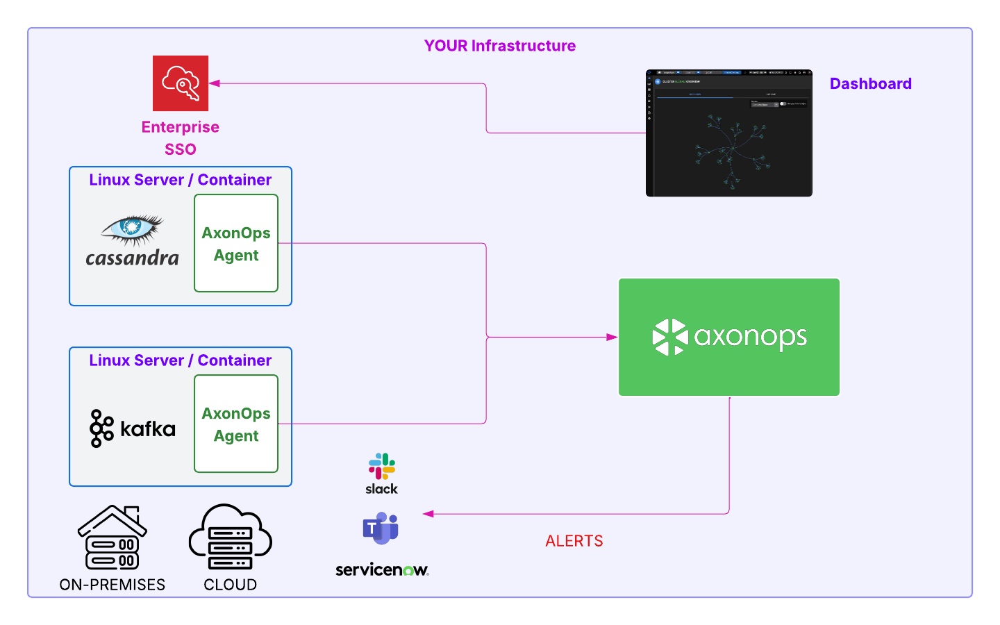

# AxonOps Self-Hosted

AxonOps Self-Hosted lets you run the AxonOps control plane inside your own infrastructure. You deploy AxonOps Server and AxonOps Dashboard alongside your existing Cassandra and Kafka environments, while the AxonOps agent runs on the data plane hosts.

## How it works

- **You host the control plane**: AxonOps Server and Dashboard run in your environment.
- **You keep your clusters**: Cassandra and Kafka continue to run in your infrastructure.
- **You install the agent**: The AxonOps agent collects metrics, logs, and operational signals and connects to your self-hosted AxonOps Server.

## Control plane and data plane

In a self-hosted deployment, both the control plane and data plane run within your network boundary. The agent uses a secure, *bi‑directional* protocol to exchange telemetry and operational actions with the AxonOps Server.

## What you get

- Centralized dashboards for Cassandra and Kafka
- Kafka management for topics, partitions, ACLs, Kafka Connect, and Schema Registry
- Health checks and alerting integrations
- Repair, backup, and operational workflows
- Log and event visibility
- User management and team access controls

## Deployment options

- Dedicated VMs or bare metal
- Kubernetes (Strimzi or K8ssandra for Kafka/Cassandra clusters)
- Air‑gapped environments

## Getting started

1. Install AxonOps Server and Dashboard.
2. Configure the metrics store (Elasticsearch or Cassandra).
3. Install the AxonOps agent on Cassandra and Kafka hosts.

Start here:

- [AxonOps Server](../installation/axon-server/axonserver_install.md)
- [AxonOps Dashboard](../installation/axon-dash/install.md)
- [AxonOps Agent](../installation/agent/install.md)
